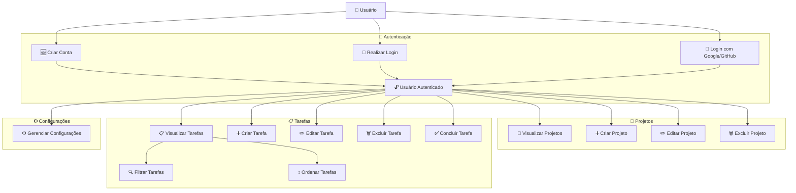

# 📝 TaskFlow

<p align="center">
  <b>Gerenciamento simples e eficiente de tarefas para o dia a dia</b>
</p>

<p align="center">
  
  
  
  
  
</p>

---

## 📖 Sobre o Projeto

O **TaskFlow** é um aplicativo de gerenciamento de tarefas (to-do list) focado em produtividade, simplicidade e organização.

O sistema permite que usuários gerenciem suas tarefas de forma eficiente, organizando-as por projetos e acompanhando seu progresso no dia a dia.

---

## ✨ Funcionalidades

- Criar, editar e excluir tarefas
- Marcar tarefas como concluídas ou pendentes
- Filtrar e ordenar tarefas
- Definir prioridade (baixa, média, alta)
- Organização por projetos
- Sistema de autenticação (login e cadastro)

---

## 🧭 Arquitetura de Rotas

A aplicação é dividida em três grupos principais:

---

### 🔓 Rotas Públicas

Acessíveis sem autenticação:

**Web**

- `/signin`
- `/signup`

**Mobile**

- `SignInScreen`
- `SignUpScreen`

📌 Usuários autenticados são redirecionados para `/dashboard`

---

### 🔐 Rotas Privadas

#### 📋 Dashboard

- `/dashboard`

Responsável por exibir:

- Lista de tarefas
- Ações rápidas

---

#### 📁 Projetos

- `/projects`
- `/projects/:projectId`

Responsável por:

- Agrupamento de tarefas
- Organização por contexto

---

#### ✅ Tarefas

**Web**

- Utiliza modais (sem rotas dedicadas)

**Mobile**

- `/tasks/create`
- `/tasks/:taskId`
- `/tasks/:taskId/edit`

---

#### ⚙️ Configurações

- `/settings`

---

### 🧱 Layout da Aplicação

#### 🌐 Web

```
/ (App Layout)
 ├── Sidebar
 ├── Header
 └── Content
```

Rotas incluídas:

- `/dashboard`
- `/projects`
- `/settings`

📌 `signin` e `signup` não utilizam esse layout

---

#### 📱 Mobile

```
Stack (Auth)
 ├── SignIn
 └── SignUp

Stack (App)
 ├── Tabs
 │    ├── Dashboard
 │    ├── Projects
 │    └── Settings
 ├── TaskCreate
 ├── TaskDetail
 └── TaskEdit
```

---

## 🖼️ Wireframes

> ⚠️ Os wireframes apresentados foram gerados com auxílio de Inteligência Artificial e têm como objetivo servir como base conceitual para o design da aplicação. As interfaces finais podem sofrer alterações durante o desenvolvimento.

Abaixo estão os wireframes utilizados para definir a estrutura e experiência do sistema, organizados por plataforma e fluxo de usuário.

---

### 🌐 Versão Web

#### 🔐 Autenticação

##### 🔑 Sign In

📌 Wireframe: `/wireframes/web/tela-signin.png`

- Campo de e-mail e senha
- Botão de login
- Opção de login com Google e GitHub (futuro)
- Link para cadastro

---

##### 🆕 Sign Up

📌 Wireframe: `/wireframes/web/tela-signup.png`

- Campos de cadastro (nome, e-mail, senha e confirmação de senha)
- Botão de criar conta
- Opção de cadastro com Google e GitHub (futuro)

---

#### 📁 Projetos

##### 📂 Lista de Projetos

📌 Wireframe: `/wireframes/web/tela-projetos.png`

- Lista de projetos do usuário
- Botão para criar novo projeto
- Acesso rápido aos projetos

---

##### ➕ Criar / Editar Projeto (Modal)

📌 Wireframe: `/wireframes/web/modal-criar-editar-projeto.png`

- Formulário em modal com campos para nome e descrição
- Seleção de cor ou identificação visual (opcional)
- Botões de salvar e cancelar

---

#### 📋 Dashboard e Tarefas

##### 📋 Dashboard

📌 Wireframe: `/wireframes/web/tela-dashboard.png`

- Navegação lateral (sidebar)
- Barra superior com ações
- Lista de tarefas com ações rápidas

---

##### ➕ Criar / Editar Tarefa (Modal)

📌 Wireframe: `/wireframes/web/modal-criar-editar-task.png`

- Formulário em modal
- Campos para título, descrição e prioridade

---

##### 🔍 Detalhes da Tarefa

📌 Wireframe: `/wireframes/web/modal-detalhes-tarefa.png`

- Visualização completa da tarefa
- Ações de editar e excluir

---

#### ⚙️ Configurações

📌 Wireframe: `/wireframes/web/tela-configuracoes.png`

- Preferências do sistema
- Configurações de tema e comportamento

---

### 📱 Versão Mobile

#### 🔐 Autenticação

##### 🔑 Sign In

📌 Wireframe: `/wireframes/mobile/tela-signin.png`

- Campo de e-mail e senha
- Botão de login e link para cadastro

---

##### 🆕 Sign Up

📌 Wireframe: `/wireframes/mobile/tela-signup.png`

- Campos de cadastro e botão de criar conta
- Navegação simples

---

#### 📁 Projetos

##### 📂 Lista de Projetos

📌 Wireframe: `/wireframes/mobile/tela-projetos.png`

- Lista vertical de projetos
- Botão de criar projeto

---

##### ➕ Criar / Editar Projeto

📌 Wireframe: `/wireframes/mobile/tela-criar-editar-projeto.png`

- Tela dedicada para criação/edição
- Campos de nome, descrição e seleção de cor
- Botão de salvar e navegação simples (voltar/cancelar)

---

#### 📋 Dashboard e Tarefas

##### 📋 Dashboard

📌 Wireframe: `/wireframes/mobile/tela-dashboard.png`

- Lista vertical de tarefas
- Botão de ação flutuante (+)

---

##### ➕ Criar / Editar Tarefa

📌 Wireframe: `/wireframes/mobile/tela-criar-editar-tarefa.png`

- Tela dedicada para criação/edição
- Inputs otimizados para mobile

---

##### 🔍 Detalhes da Tarefa

📌 Wireframe: `/wireframes/mobile/tela-detalhes-tarefa.png`

- Visualização simplificada
- Ações rápidas

---

#### ⚙️ Configurações

📌 Wireframe: `/wireframes/mobile/tela-configuracoes.png`

- Preferências do usuário
- Ajustes do aplicativo

---

## 📊 Diagramas

### 📌 Diagrama de Casos de Uso



---

## 🧩 Tecnologias

### 🎨 Frontend (Web)

- React
- TypeScript
- Vite

### 📱 Mobile

- React Native

### ⚙️ Backend

- Python (FastAPI)

### 🗄️ Database

- PostgreSQL

### 🔧 Arquitetura e Ferramentas

- API REST
- JWT (autenticação)
- Context API / Zustand (estado)

---

## 🚀 Roadmap

### 🔐 Autenticação

- [ ] Login
- [ ] Cadastro
- [ ] Validação de formulário
- [ ] Sessão de usuário

---

### 📁 Projetos

- [ ] Criar projeto
- [ ] Editar projeto
- [ ] Excluir projeto
- [ ] Listar projetos
- [ ] Filtros
- [ ] Ordenação

---

### 📋 Tarefas

- [ ] CRUD completo
- [ ] Filtros
- [ ] Ordenação
- [ ] Prioridades
- [ ] Vincular a projetos

---

### ⚙️ Configurações

- [ ] Tema (light/dark)
- [ ] Preferências do usuário
- [ ] Conta

---

## 💡 Melhorias Futuras

- Login com Google
- Login com GitHub
- Notificações em tempo real
- Drag and drop
- Modo offline
- Sincronização entre dispositivos
- Compartilhamento de projetos
- Integração com calendário

---

## 📄 Licença

Este projeto está sob a licença **MIT**.

---

## 👨‍💻 Autor

Desenvolvido por **Kevyn Aparecido**
