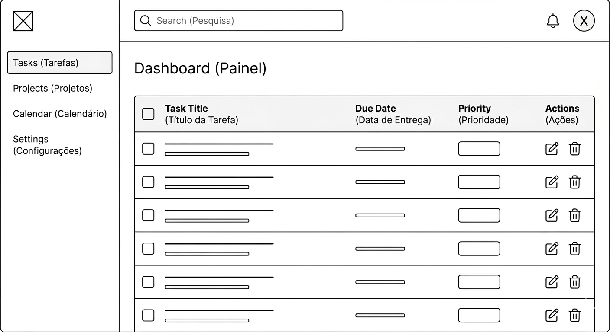
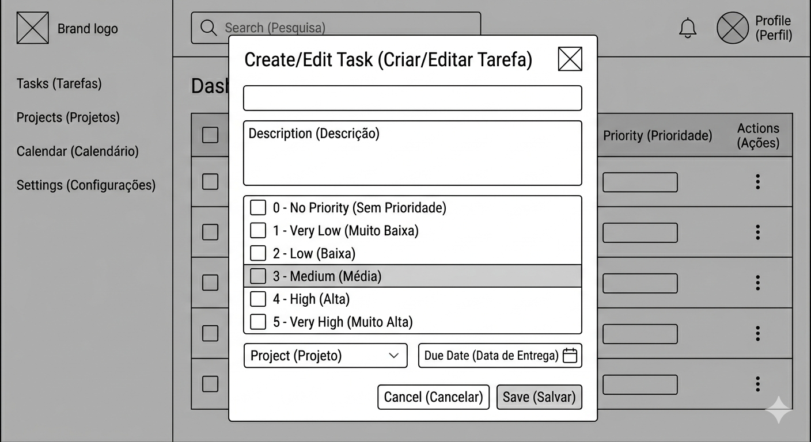
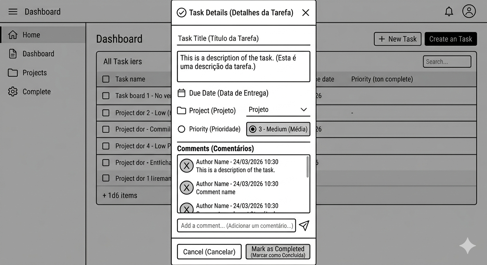
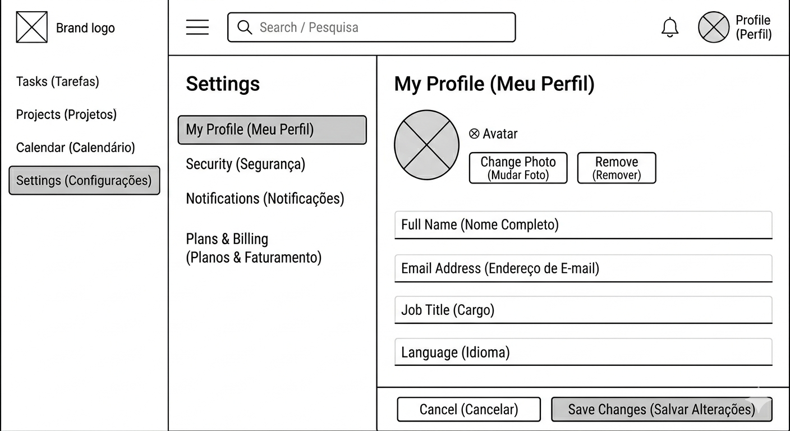
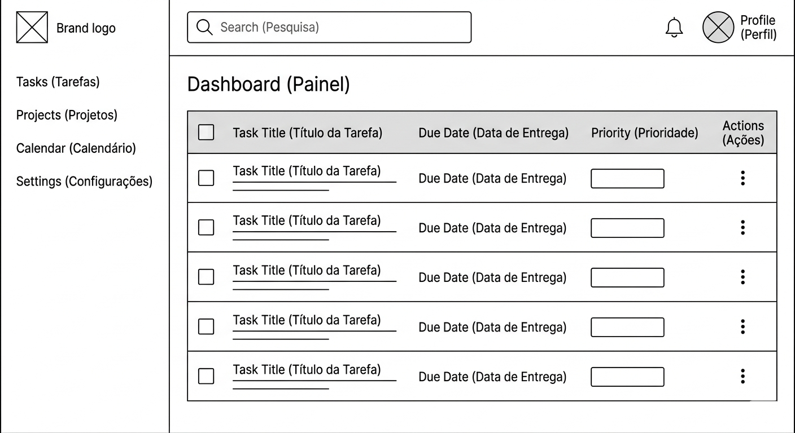
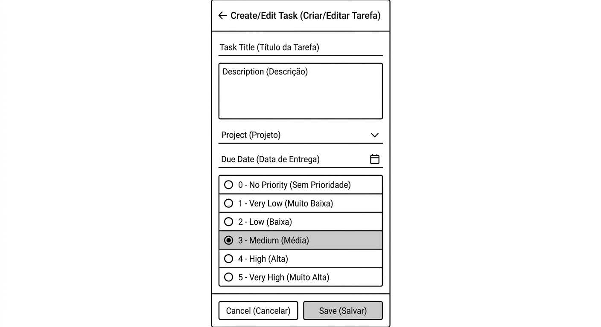
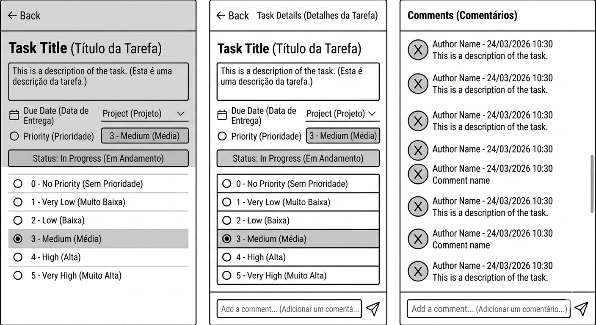
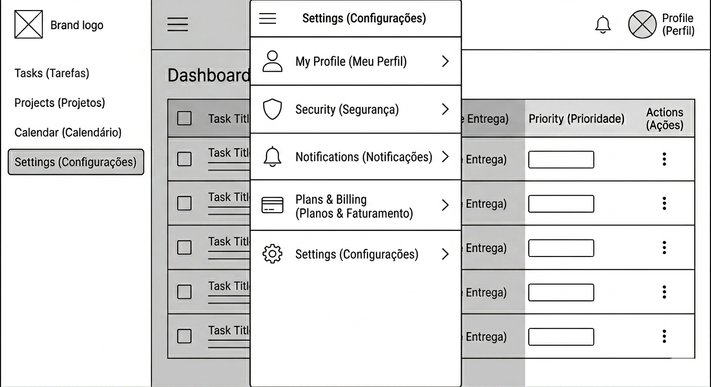

# 📝 TaskFlow

  <b>Gerenciamento simples e eficiente de tarefas para o dia a dia</b>

  
  
  

---

## 📖 Sobre o Projeto

O **TaskFlow** é um aplicativo de gerenciamento de tarefas (to-do list) desenvolvido para ajudar usuários a organizarem suas atividades diárias de forma prática e eficiente.

O sistema tem como foco uma experiência simples, intuitiva e rápida, sendo ideal tanto para uso pessoal quanto profissional.

---

## ✨ Funcionalidades

- Criar novas tarefas
- Editar tarefas existentes
- Excluir tarefas
- Marcar tarefas como concluídas ou pendentes
- Listar todas as tarefas
- Filtrar tarefas (todas, concluídas, pendentes)
- Ordenar tarefas (por data, prioridade, etc.)
- Definir prioridade (baixa, média, alta)

---

## 🖼️ Wireframes

> Abaixo estão os wireframes utilizados para definir a estrutura e experiência do sistema.

---

# 🌐 Versão Web

## 📋 Dashboard

📌 Wireframe: `/wireframes/web/tela-dashboard.png`

- Navegação lateral (sidebar)
- Barra superior com ações
- Lista de tarefas com ações rápidas

---

## ➕ Criar / Editar Tarefa (Modal)

📌 Wireframe: `/wireframes/web/modal-criar-editar-tarefa.png`

- Formulário em modal
- Campos para título, descrição e prioridade

---

## 🔍 Detalhes da Tarefa

📌 Wireframe: `/wireframes/web/modal-detalhes-tarefa.png`

- Visualização completa da tarefa
- Ações de editar e excluir

---

## ⚙️ Configurações

📌 Wireframe: `/wireframes/web/tela-configuracoes.png`

- Preferências do sistema
- Configurações de tema e comportamento

---

# 📱 Versão Mobile

## 📋 Dashboard

📌 Wireframe: `/wireframes/mobile/tela-dashboard.png`

- Lista vertical de tarefas
- Botão de ação flutuante (+)

---

## ➕ Criar / Editar Tarefa

📌 Wireframe: `/wireframes/mobile/tela-criar-editar-tarefa.png`

- Tela dedicada para criação/edição
- Inputs otimizados para mobile

---

## 🔍 Detalhes da Tarefa

📌 Wireframe: `/wireframes/mobile/tela-detalhes-tarefa.png`

- Visualização simplificada
- Ações rápidas

---

## ⚙️ Configurações

📌 Wireframe: `/wireframes/mobile/tela-configuracoes.png`

- Preferências do usuário
- Ajustes do aplicativo

---

## 🧩 Tecnologias

> Será definido após o desenvolvimento.

---

## 🚀 Roadmap

### 🌐 Web

#### 📋 Dashboard

- [ ] Listar tarefas
- [ ] Marcar como concluída
- [ ] Excluir tarefa
- [ ] Filtros
- [ ] Ordenação

#### ➕ Criar / Editar

- [ ] Criar tarefa
- [ ] Editar tarefa
- [ ] Definir prioridade
- [ ] Validação

#### 🔍 Detalhes

- [ ] Exibir dados completos
- [ ] Editar
- [ ] Excluir

#### ⚙️ Configurações

- [ ] Tema
- [ ] Preferências
- [ ] Comportamento padrão

---

### 📱 Mobile

#### 📋 Tela principal

- [ ] Listagem otimizada
- [ ] Ações rápidas
- [ ] Navegação simples

#### ➕ Criar / Editar

- [ ] Formulário mobile
- [ ] Inputs otimizados

#### 🔍 Detalhes

- [ ] Visualização simplificada
- [ ] Ações rápidas

#### ⚙️ Configurações

- [ ] Ajustes do app
- [ ] Preferências

---

## 💡 Atualizações futuras

- Drag and drop de tarefas
- Notificações em tempo real
- Tema dark/light avançado
- Melhorias de responsividade
- Histórico de atividades
- Integração com calendário
- Compartilhamento de tarefas
- Sistema de categorias/tags
- Modo offline
- Sincronização entre dispositivos

---

## 📄 Licença

Este projeto está sob a licença **MIT**.

---

## 👨‍💻 Autor

Desenvolvido por **Kevyn Aparecido**
