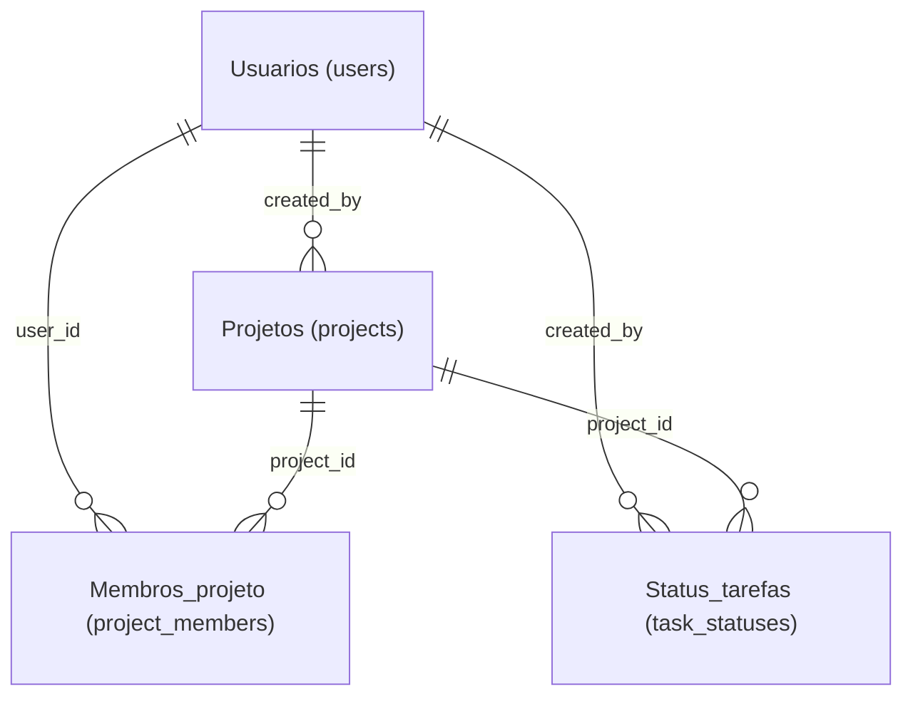
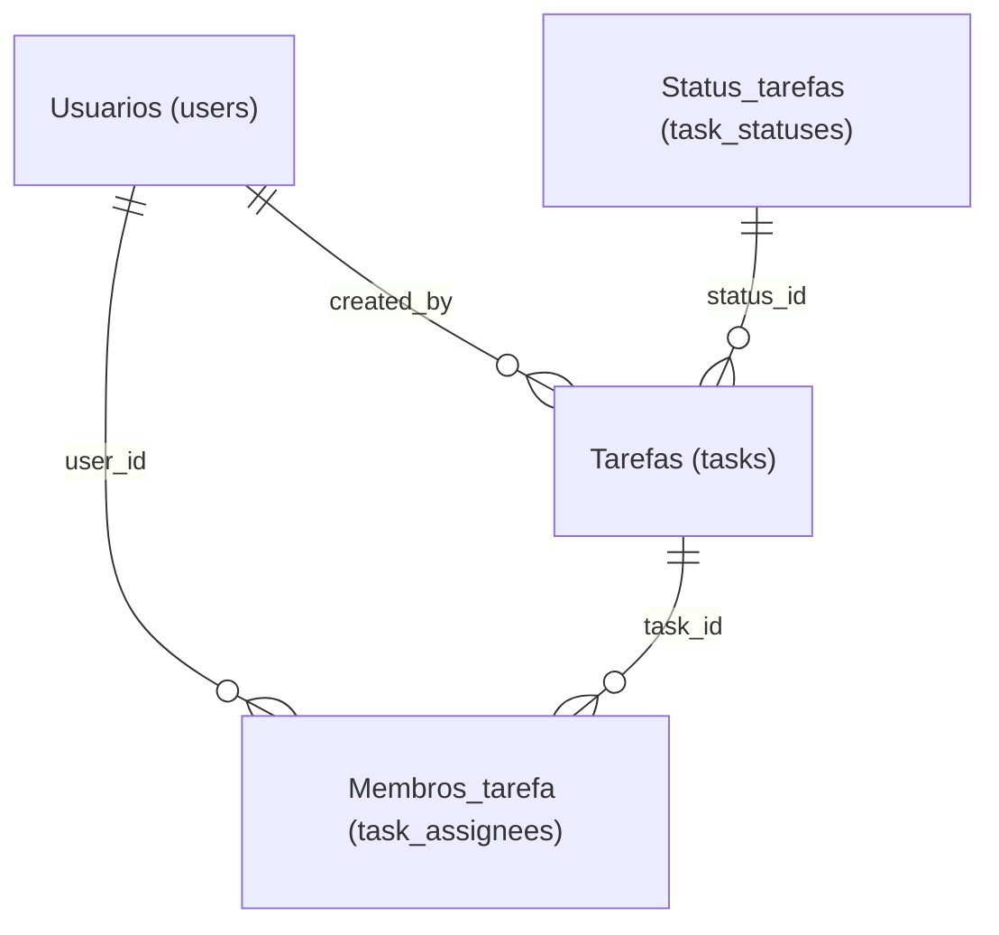

← Voltar para [Diagramas](../diagrams.md)

## 🧩 Diagrama ER (Entidade - Relacionamento)

### Diagrama ER — Usuários e Projetos

- Inclui users, projects, project_members, task_statuses
- Mostra quem criou/atualizou/desativou e membros do projeto

💡 Comentário:
Esse diagrama mostra estrutura de projetos e usuários, incluindo membros e status das tarefas vinculados ao projeto.

### Diagrama ER — Tarefas e Membros

- Inclui tasks, task_statuses, task_assignees
- Mostra status, tarefas e quais usuários estão atribuídos

💡 Comentário:
Esse diagrama mostra as tarefas e os usuários atribuídos, mantendo os status e relacionamentos visíveis.
