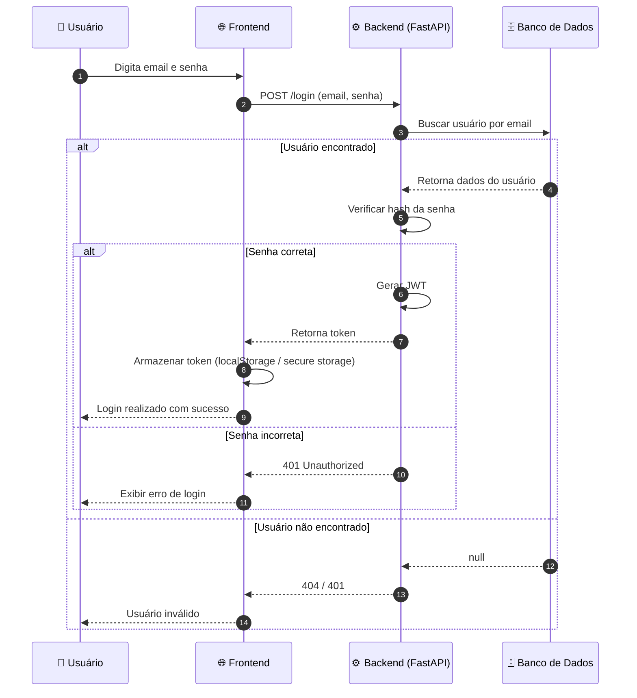
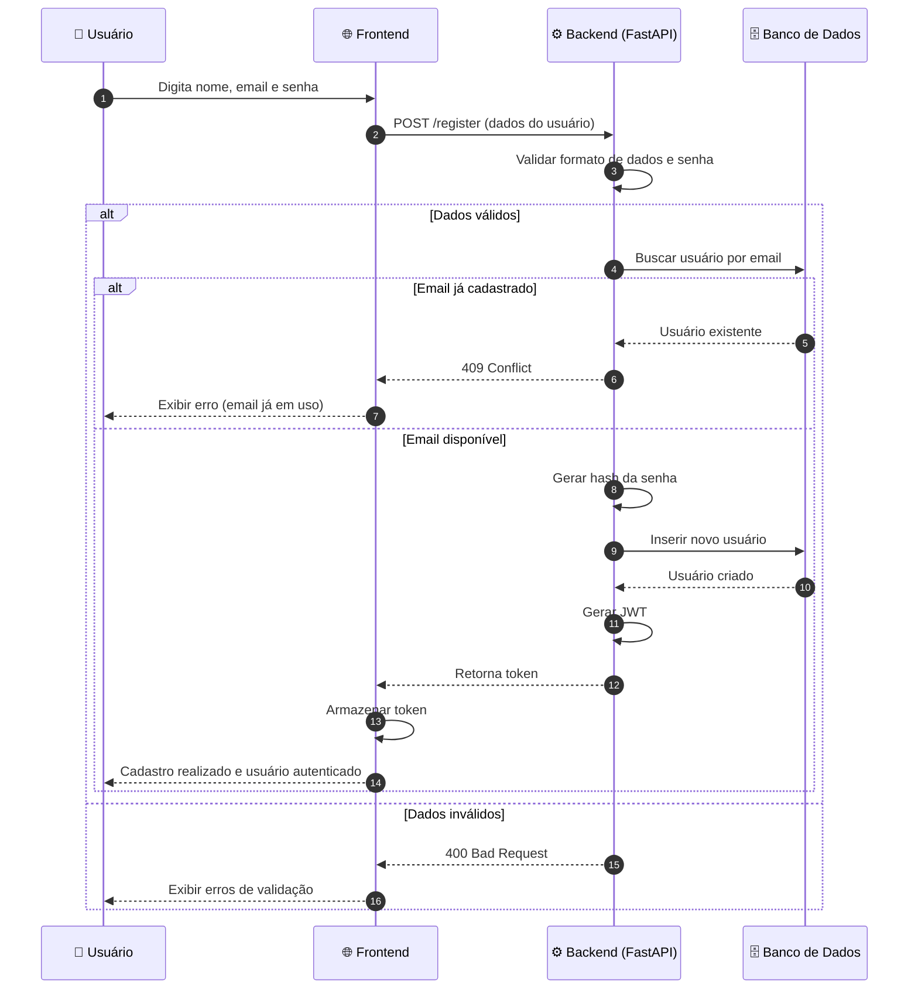
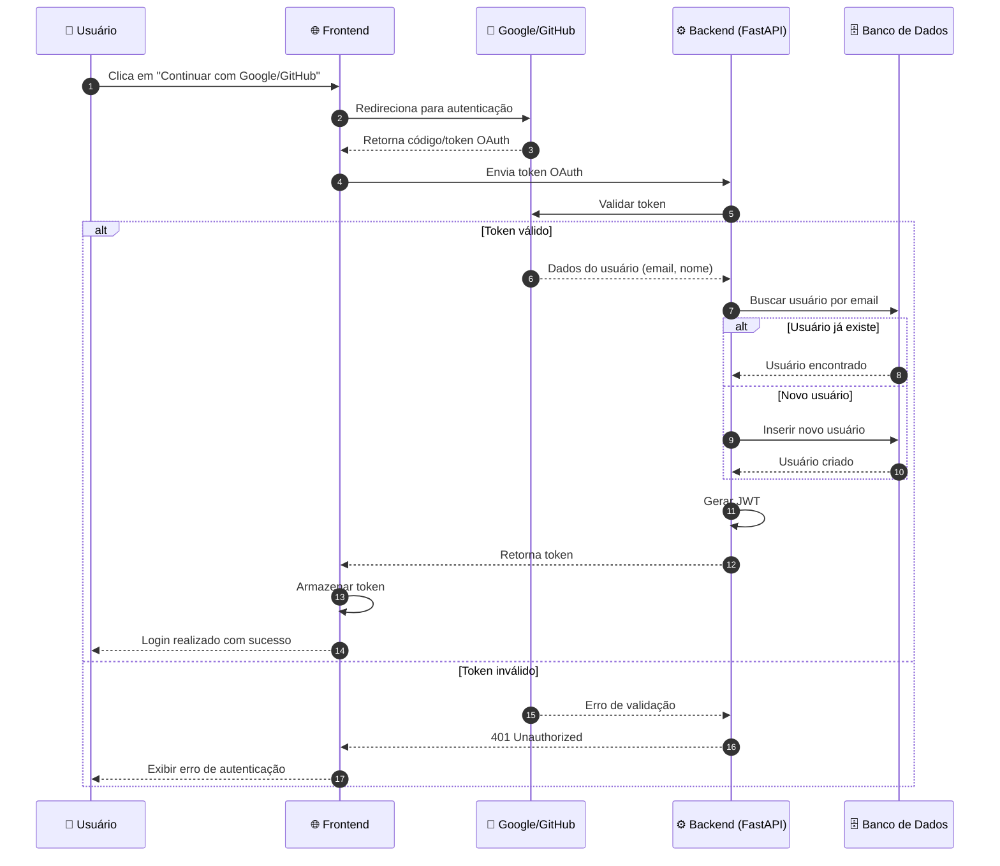
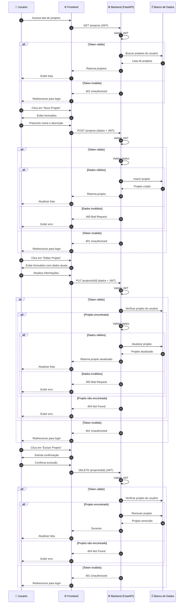
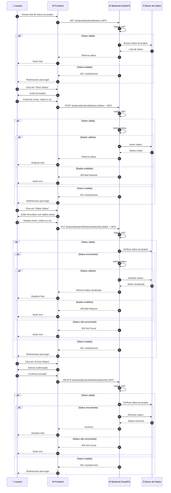

← Voltar para [Diagramas](../diagrams.md)

## 🔄 Diagramas de Sequência

### Login (Email e Senha)

### Cadastro (Sign Up)

### Login/Cadastro com Google/GitHub

### Projetos (CRUD Completo)

### Status (CRUD Completo)

### Tarefas (CRUD Completo)

```mermaid id="seq-tasks-crud"
sequenceDiagram
    autonumber
    participant U as 👤 Usuário
    participant FE as 🌐 Frontend
    participant API as ⚙️ Backend (FastAPI)
    participant DB as 🗄️ Banco de Dados

    %% 1. Listar tarefas
    U->>FE: Acessa dashboard / projeto
    FE->>API: GET /tasks?project_id (JWT)
    API->>API: Validar JWT

    alt Token válido
        API->>DB: Buscar tarefas do projeto (usuário)
        DB-->>API: Lista de tarefas
        API-->>FE: Retorna tarefas
        FE-->>U: Exibir lista
    else Token inválido
        API-->>FE: 401 Unauthorized
        FE-->>U: Redirecionar para login
    end

    %% 2. Criar tarefa
    U->>FE: Clica em "Nova Tarefa"
    FE->>U: Exibe formulário
    U->>FE: Preenche título, descrição, prioridade
    FE->>API: POST /tasks (dados + JWT)
    API->>API: Validar JWT

    alt Token válido
        API->>API: Validar dados
        alt Dados válidos
            API->>DB: Inserir tarefa
            DB-->>API: Tarefa criada
            API-->>FE: Retorna tarefa
            FE-->>U: Atualizar lista
        else Dados inválidos
            API-->>FE: 400 Bad Request
            FE-->>U: Exibir erro
        end
    else Token inválido
        API-->>FE: 401 Unauthorized
        FE-->>U: Redirecionar para login
    end

    %% 3. Editar tarefa
    U->>FE: Clica em "Editar Tarefa"
    FE->>U: Exibe formulário com dados atuais
    U->>FE: Atualiza informações
    FE->>API: PUT /tasks/{id} (dados + JWT)
    API->>API: Validar JWT

    alt Token válido
        API->>DB: Verificar tarefa do usuário
        alt Tarefa encontrada
            API->>API: Validar dados
            alt Dados válidos
                API->>DB: Atualizar tarefa
                DB-->>API: Tarefa atualizada
                API-->>FE: Retorna tarefa atualizada
                FE-->>U: Atualizar lista
            else Dados inválidos
                API-->>FE: 400 Bad Request
                FE-->>U: Exibir erro
            end
        else Tarefa não encontrada
            API-->>FE: 404 Not Found
            FE-->>U: Exibir erro
        end
    else Token inválido
        API-->>FE: 401 Unauthorized
        FE-->>U: Redirecionar para login
    end

    %% 4. Alterar status da tarefa
    U->>FE: Seleciona novo status (personalizado)
    FE->>API: PATCH /tasks/{id}/status (status + JWT)
    API->>API: Validar JWT

    alt Token válido
        API->>DB: Verificar tarefa do usuário
        alt Tarefa encontrada
            API->>DB: Atualizar status
            DB-->>API: Tarefa atualizada
            API-->>FE: Retorna tarefa atualizada
            FE-->>U: Atualizar status na tela
        else Tarefa não encontrada
            API-->>FE: 404 Not Found
            FE-->>U: Exibir erro
        end
    else Token inválido
        API-->>FE: 401 Unauthorized
        FE-->>U: Redirecionar para login
    end

    %% 5. Definir prioridade
    U->>FE: Altera prioridade da tarefa
    FE->>API: PATCH /tasks/{id}/priority (prioridade + JWT)
    API->>API: Validar JWT

    alt Token válido
        API->>DB: Atualizar prioridade
        DB-->>API: Tarefa atualizada
        API-->>FE: Retorna tarefa atualizada
        FE-->>U: Atualizar prioridade na tela
    else Token inválido
        API-->>FE: 401 Unauthorized
        FE-->>U: Redirecionar para login
    end

    %% 6. Excluir tarefa
    U->>FE: Clica em "Excluir Tarefa"
    FE->>U: Solicita confirmação
    U->>FE: Confirma exclusão
    FE->>API: DELETE /tasks/{id} (JWT)
    API->>API: Validar JWT

    alt Token válido
        API->>DB: Verificar tarefa do usuário
        alt Tarefa encontrada
            API->>DB: Remover tarefa
            DB-->>API: Tarefa removida
            API-->>FE: Sucesso
            FE-->>U: Atualizar lista
        else Tarefa não encontrada
            API-->>FE: 404 Not Found
            FE-->>U: Exibir erro
        end
    else Token inválido
        API-->>FE: 401 Unauthorized
        FE-->>U: Redirecionar para login
    end
```

