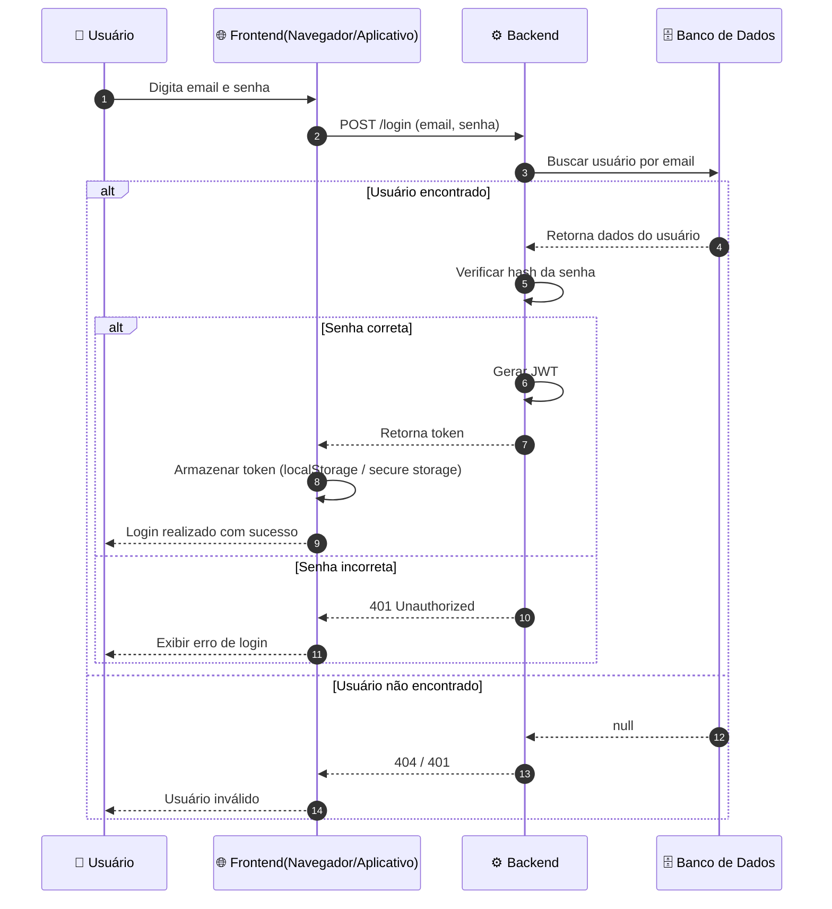
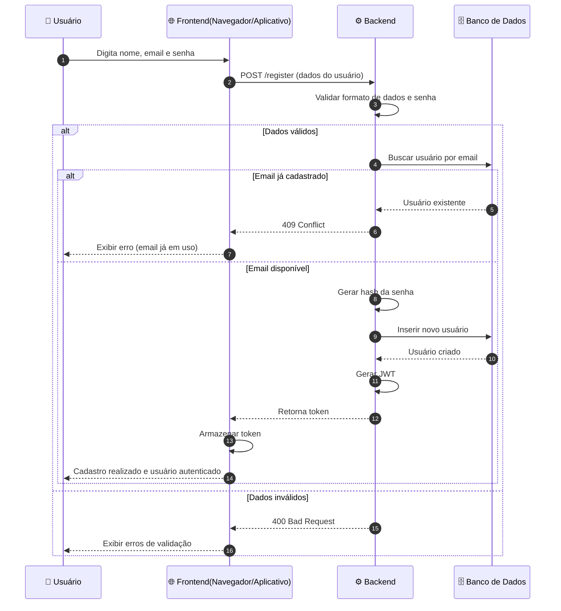
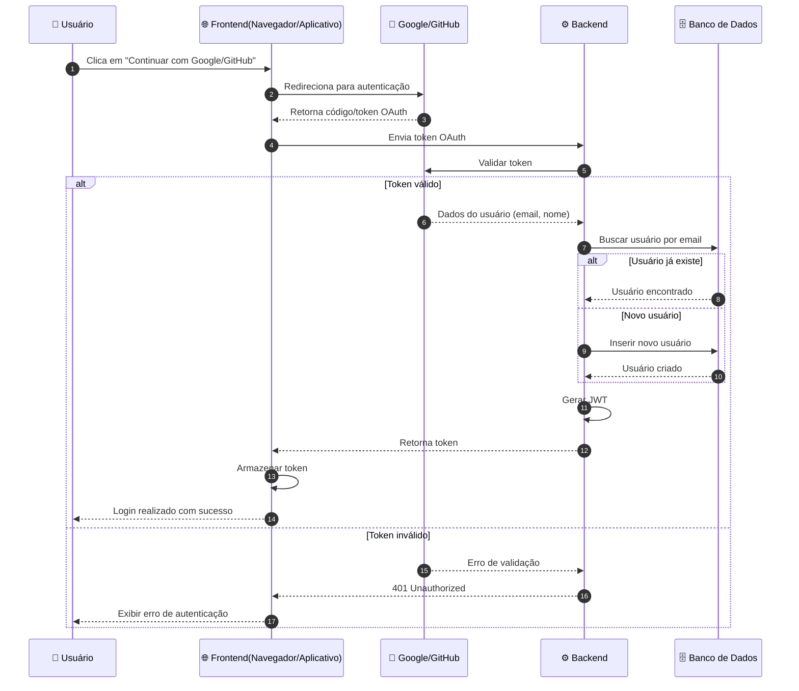

Voltar para [🔄 Diagramas de Sequência](../index.md)

---

[Início](../../../../README.md) | [📊 Diagramas](../../index.md) | [🔄 Diagramas de Sequência](../index.md) | Autenticação

---

## Autenticação

### Login (Email e Senha)

### Cadastro (Sign Up)

### Login/Cadastro com Google/GitHub

