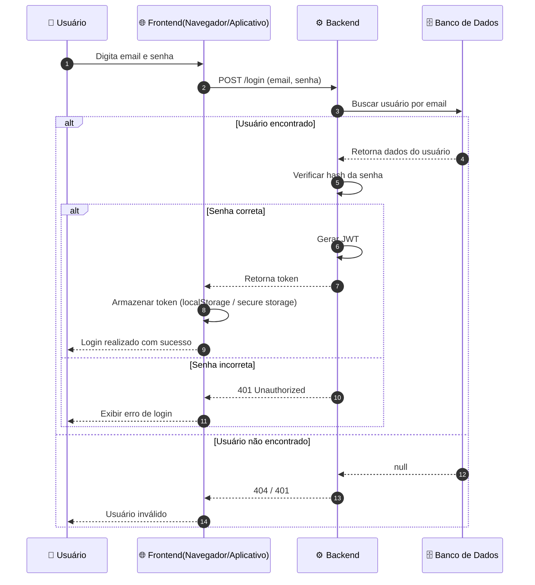

Voltar para [Autenticação](../index.md)

---

[Início](../../../../../README.md) | [📊 Diagramas](../../../index.md) | [🔄 Diagramas de Sequência](../../index.md) | [Autenticação](../index.md) | Login (Email e Senha)

---

## Login (Email e Senha)

