Voltar para [📊 Diagramas](../index.md)

---

[Início](../../../README.md) | [📊 Diagramas](../index.md) | 🔄 Diagramas de Sequência

---

## 🔄 Diagramas de Sequência

### Autenticação

#### Login (Email e Senha)

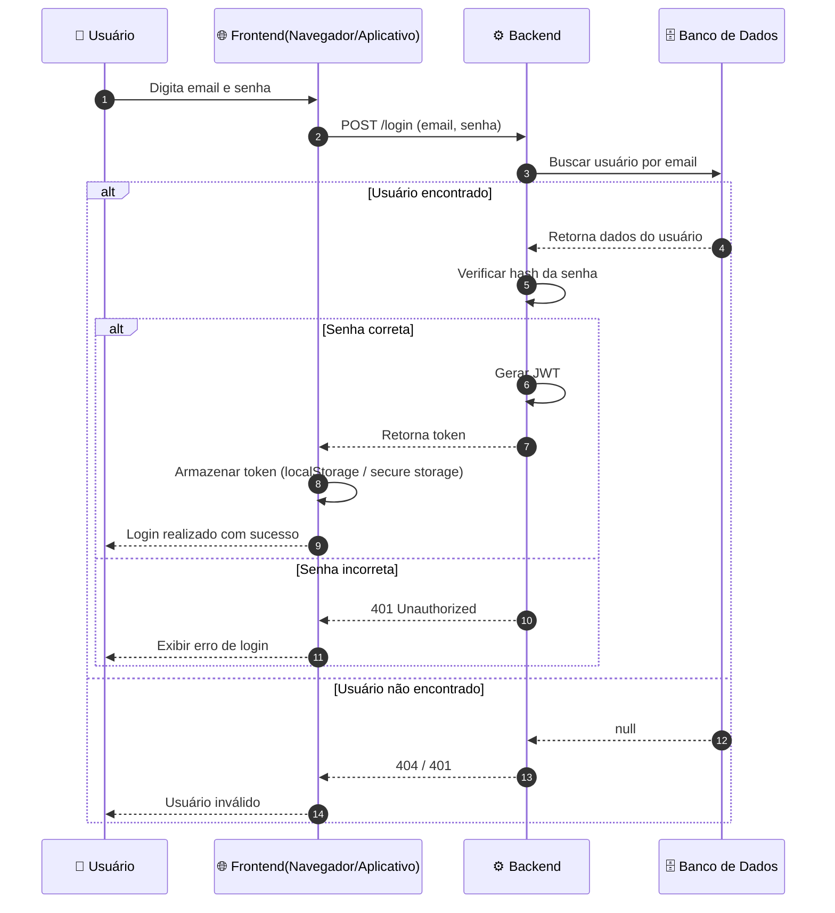
```mermaid
sequenceDiagram
    autonumber
    participant U as 👤 Usuário
    participant FE as 🌐 Frontend(Navegador/Aplicativo)
    participant API as ⚙️ Backend
    participant DB as 🗄️ Banco de Dados

    %% 1. Preencher credenciais
    U->>FE: Digita email e senha
    FE->>API: POST /login (email, senha)

    %% 2. Buscar usuário
    API->>DB: Buscar usuário por email

    alt Usuário encontrado
        DB-->>API: Retorna dados do usuário

        %% 3. Verificar senha
        API->>API: Verificar hash da senha

        alt Senha correta
            %% 4. Gerar token
            API->>API: Gerar JWT
            API-->>FE: Retorna token

            %% 5. Armazenar token
            FE->>FE: Armazenar token (localStorage / secure storage)
            FE-->>U: Login realizado com sucesso
        else Senha incorreta
            API-->>FE: 401 Unauthorized
            FE-->>U: Exibir erro de login
        end

    else Usuário não encontrado
        DB-->>API: null
        API-->>FE: 404 / 401
        FE-->>U: Usuário inválido
    end
```

#### Cadastro (Sign Up)

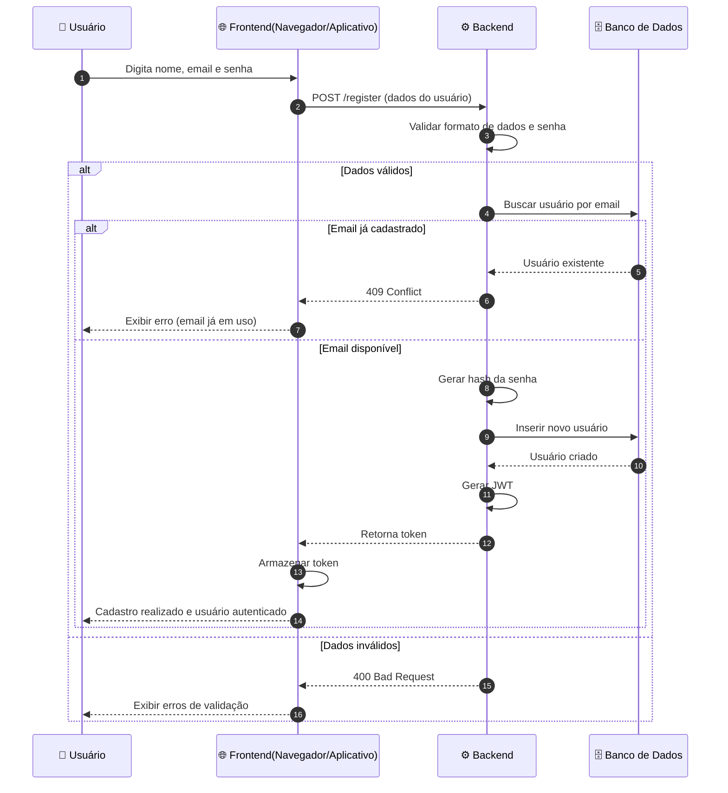
```mermaid
sequenceDiagram
    autonumber
    participant U as 👤 Usuário
    participant FE as 🌐 Frontend(Navegador/Aplicativo)
    participant API as ⚙️ Backend
    participant DB as 🗄️ Banco de Dados

    %% 1. Preencher dados do usuário
    U->>FE: Digita nome, email e senha
    FE->>API: POST /register (dados do usuário)

    %% 2. Validar dados no backend
    API->>API: Validar formato de dados e senha

    alt Dados válidos
        %% 3. Verificar se email já existe
        API->>DB: Buscar usuário por email

        alt Email já cadastrado
            DB-->>API: Usuário existente
            API-->>FE: 409 Conflict
            FE-->>U: Exibir erro (email já em uso)
        else Email disponível
            %% 4. Criar usuário
            API->>API: Gerar hash da senha
            API->>DB: Inserir novo usuário
            DB-->>API: Usuário criado

            %% 5. Gerar token JWT
            API->>API: Gerar JWT
            API-->>FE: Retorna token

            %% 6. Armazenar token e autenticar
            FE->>FE: Armazenar token
            FE-->>U: Cadastro realizado e usuário autenticado
        end

    else Dados inválidos
        API-->>FE: 400 Bad Request
        FE-->>U: Exibir erros de validação
    end
```

#### Login/Cadastro com Google/GitHub

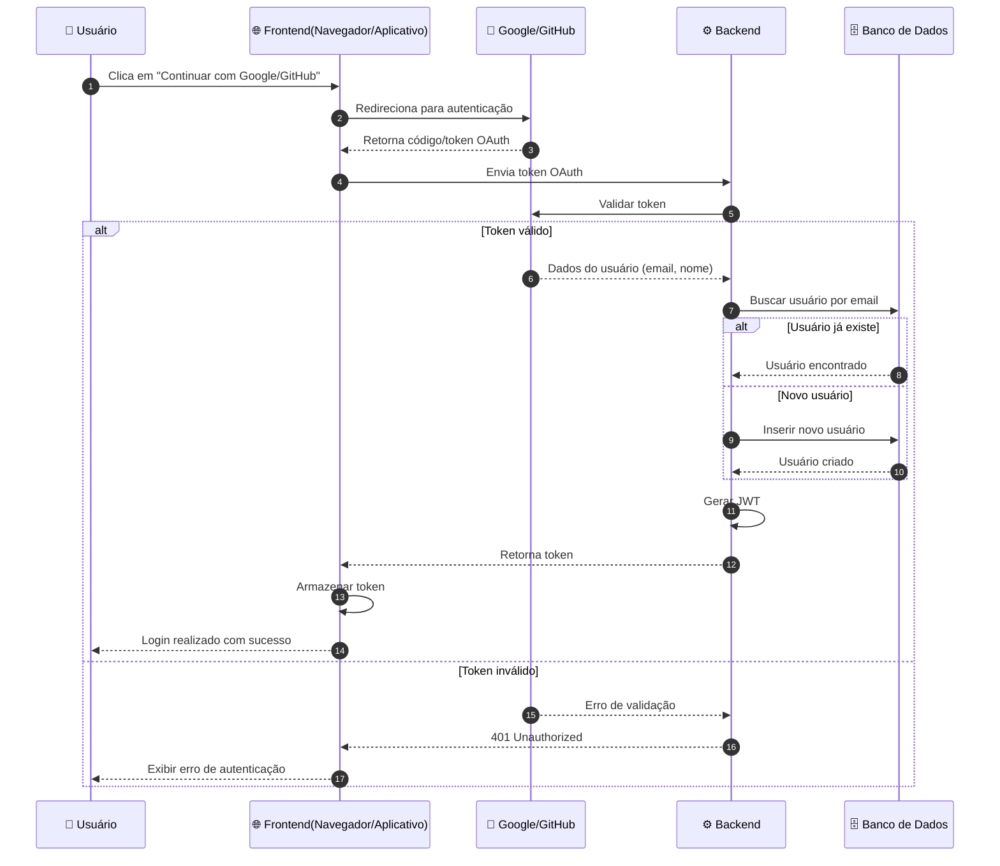
```mermaid
sequenceDiagram
    autonumber
    participant U as 👤 Usuário
    participant FE as 🌐 Frontend(Navegador/Aplicativo)
    participant OAUTH as 🔗 Google/GitHub
    participant API as ⚙️ Backend
    participant DB as 🗄️ Banco de Dados

    %% 1. Usuário inicia login social
    U->>FE: Clica em "Continuar com Google/GitHub"
    FE->>OAUTH: Redireciona para autenticação

    %% 2. Retorno do OAuth
    OAUTH-->>FE: Retorna código/token OAuth
    FE->>API: Envia token OAuth

    %% 3. Validação do token no backend
    API->>OAUTH: Validar token

    alt Token válido
        OAUTH-->>API: Dados do usuário (email, nome)

        %% 4. Verificar se usuário já existe
        API->>DB: Buscar usuário por email

        alt Usuário já existe
            DB-->>API: Usuário encontrado
        else Novo usuário
            %% 5. Criar usuário automaticamente
            API->>DB: Inserir novo usuário
            DB-->>API: Usuário criado
        end

        %% 6. Gerar token JWT
        API->>API: Gerar JWT
        API-->>FE: Retorna token

        %% 7. Armazenar token e autenticar
        FE->>FE: Armazenar token
        FE-->>U: Login realizado com sucesso

    else Token inválido
        OAUTH-->>API: Erro de validação
        API-->>FE: 401 Unauthorized
        FE-->>U: Exibir erro de autenticação
    end
```

### Projetos

#### Listar projetos

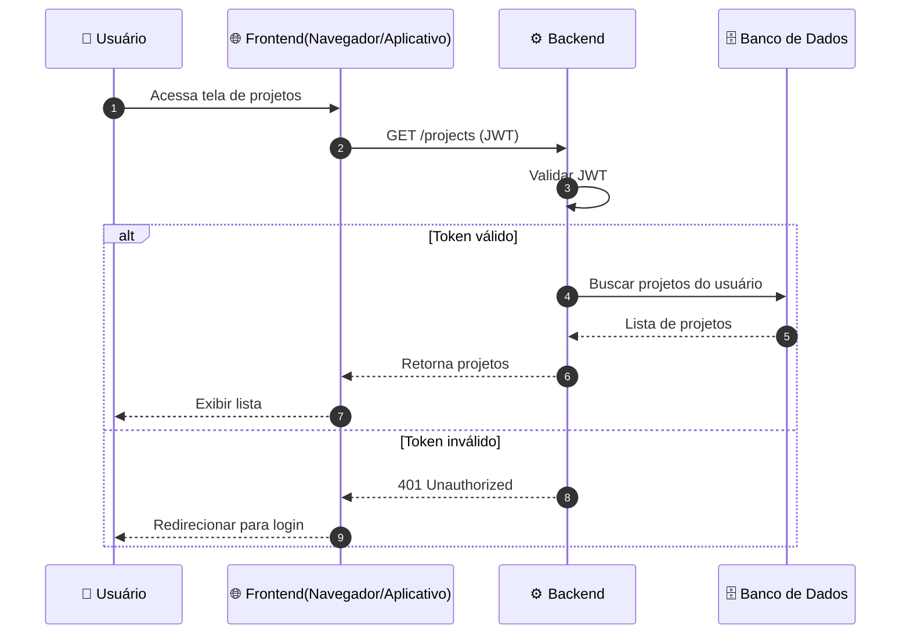
```mermaid
sequenceDiagram
    autonumber
    participant U as 👤 Usuário
    participant FE as 🌐 Frontend(Navegador/Aplicativo)
    participant API as ⚙️ Backend
    participant DB as 🗄️ Banco de Dados

    U->>FE: Acessa tela de projetos
    FE->>API: GET /projects (JWT)
    API->>API: Validar JWT

    alt Token válido
        API->>DB: Buscar projetos do usuário
        DB-->>API: Lista de projetos
        API-->>FE: Retorna projetos
        FE-->>U: Exibir lista
    else Token inválido
        API-->>FE: 401 Unauthorized
        FE-->>U: Redirecionar para login
    end
```

#### Criar projeto

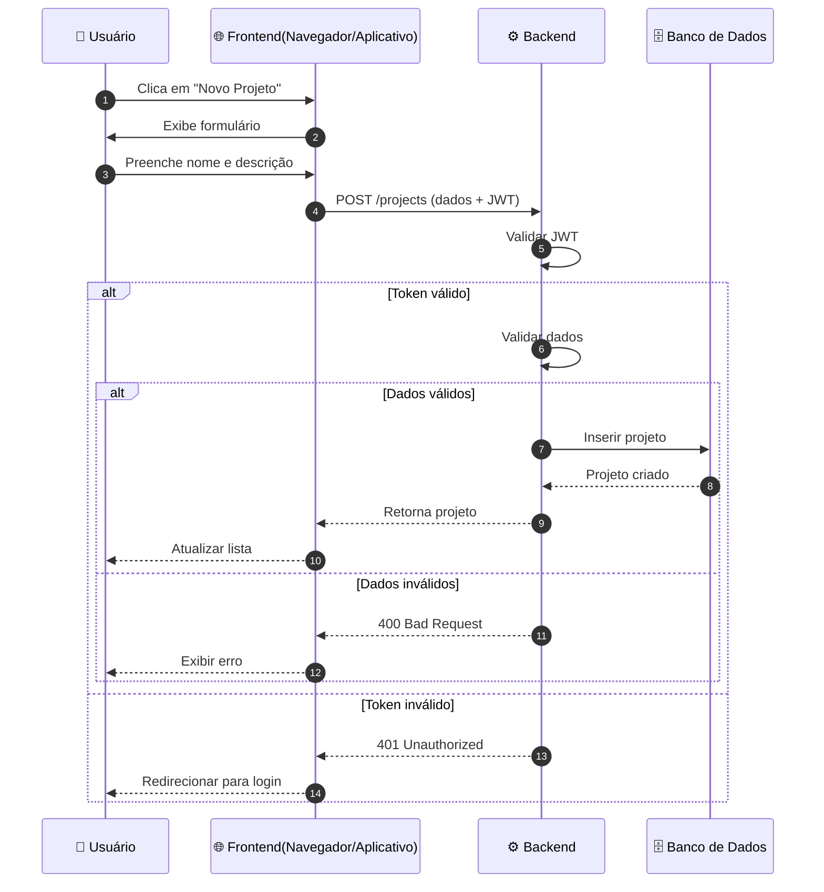
```mermaid
sequenceDiagram
    autonumber
    participant U as 👤 Usuário
    participant FE as 🌐 Frontend(Navegador/Aplicativo)
    participant API as ⚙️ Backend
    participant DB as 🗄️ Banco de Dados

    U->>FE: Clica em "Novo Projeto"
    FE->>U: Exibe formulário
    U->>FE: Preenche nome e descrição
    FE->>API: POST /projects (dados + JWT)
    API->>API: Validar JWT

    alt Token válido
        API->>API: Validar dados
        alt Dados válidos
            API->>DB: Inserir projeto
            DB-->>API: Projeto criado
            API-->>FE: Retorna projeto
            FE-->>U: Atualizar lista
        else Dados inválidos
            API-->>FE: 400 Bad Request
            FE-->>U: Exibir erro
        end
    else Token inválido
        API-->>FE: 401 Unauthorized
        FE-->>U: Redirecionar para login
    end
```

#### Editar projeto

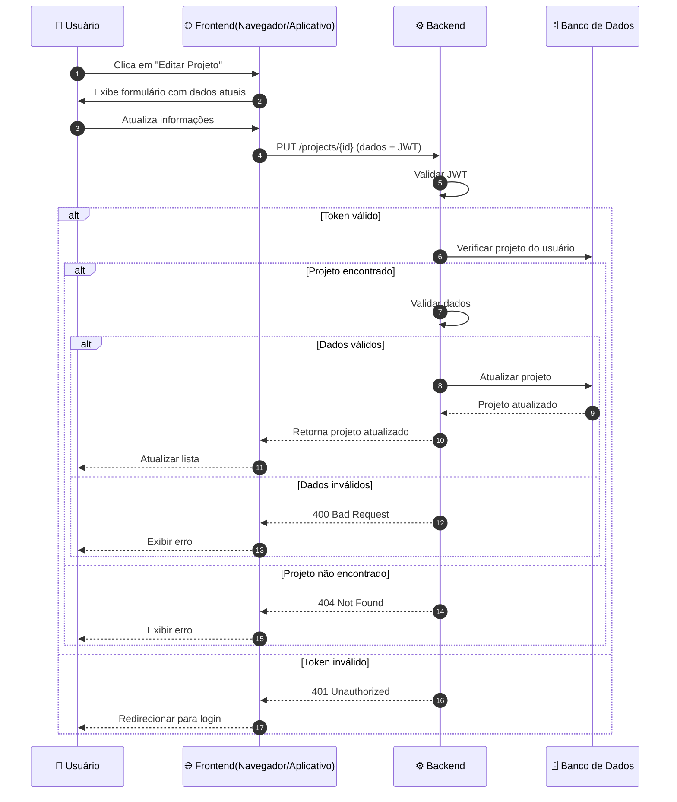
```mermaid
sequenceDiagram
    autonumber
    participant U as 👤 Usuário
    participant FE as 🌐 Frontend(Navegador/Aplicativo)
    participant API as ⚙️ Backend
    participant DB as 🗄️ Banco de Dados

    U->>FE: Clica em "Editar Projeto"
    FE->>U: Exibe formulário com dados atuais
    U->>FE: Atualiza informações
    FE->>API: PUT /projects/{id} (dados + JWT)
    API->>API: Validar JWT

    alt Token válido
        API->>DB: Verificar projeto do usuário
        alt Projeto encontrado
            API->>API: Validar dados
            alt Dados válidos
                API->>DB: Atualizar projeto
                DB-->>API: Projeto atualizado
                API-->>FE: Retorna projeto atualizado
                FE-->>U: Atualizar lista
            else Dados inválidos
                API-->>FE: 400 Bad Request
                FE-->>U: Exibir erro
            end
        else Projeto não encontrado
            API-->>FE: 404 Not Found
            FE-->>U: Exibir erro
        end
    else Token inválido
        API-->>FE: 401 Unauthorized
        FE-->>U: Redirecionar para login
    end
```

#### Excluir projeto

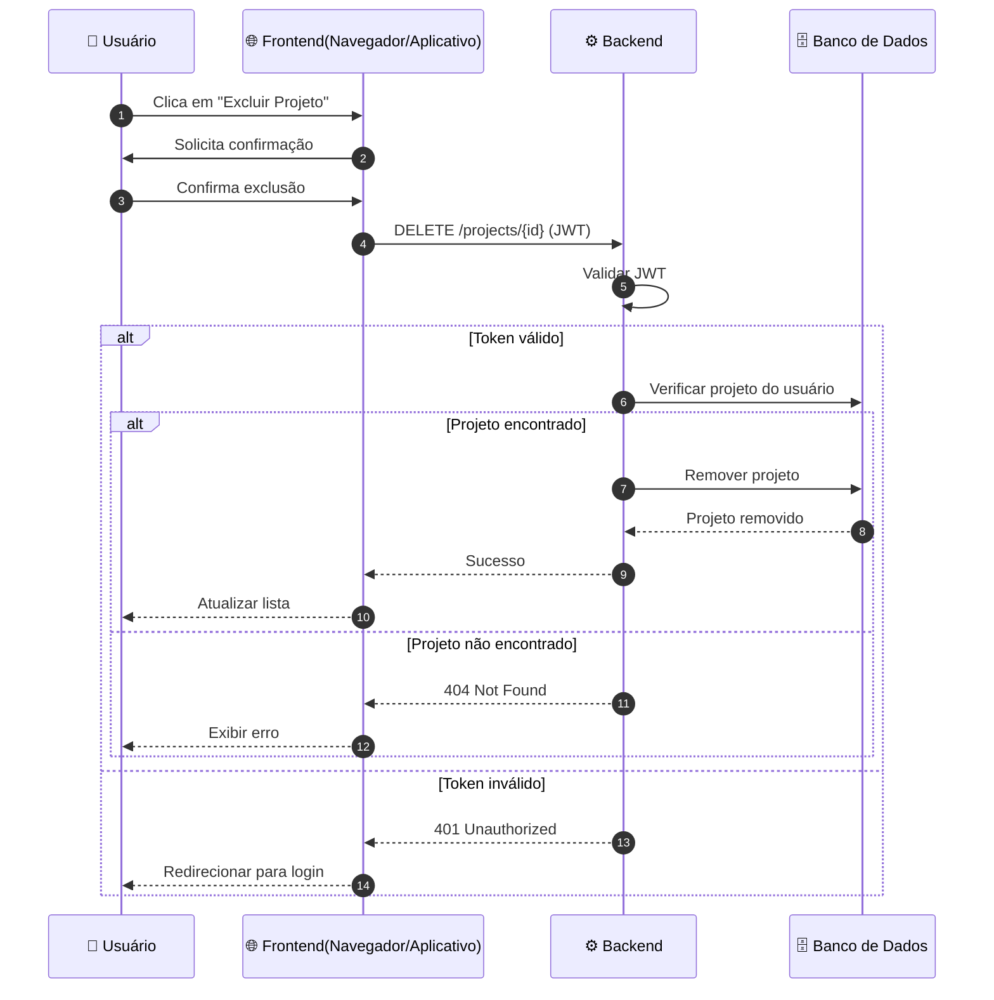
```mermaid
sequenceDiagram
    autonumber
    participant U as 👤 Usuário
    participant FE as 🌐 Frontend(Navegador/Aplicativo)
    participant API as ⚙️ Backend
    participant DB as 🗄️ Banco de Dados

    U->>FE: Clica em "Excluir Projeto"
    FE->>U: Solicita confirmação
    U->>FE: Confirma exclusão
    FE->>API: DELETE /projects/{id} (JWT)
    API->>API: Validar JWT

    alt Token válido
        API->>DB: Verificar projeto do usuário
        alt Projeto encontrado
            API->>DB: Remover projeto
            DB-->>API: Projeto removido
            API-->>FE: Sucesso
            FE-->>U: Atualizar lista
        else Projeto não encontrado
            API-->>FE: 404 Not Found
            FE-->>U: Exibir erro
        end
    else Token inválido
        API-->>FE: 401 Unauthorized
        FE-->>U: Redirecionar para login
    end
```

### Colunas (por projeto)

#### Listar colunas de status

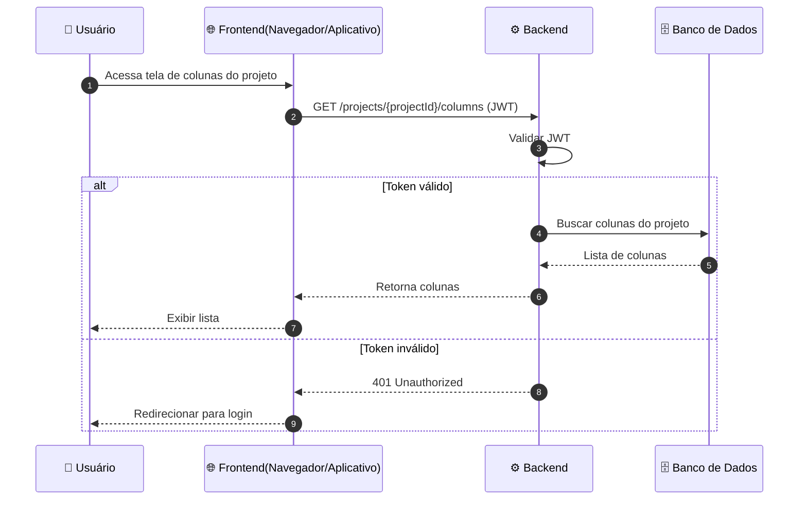
```mermaid
sequenceDiagram
    autonumber
    participant U as 👤 Usuário
    participant FE as 🌐 Frontend(Navegador/Aplicativo)
    participant API as ⚙️ Backend
    participant DB as 🗄️ Banco de Dados

    U->>FE: Acessa tela de colunas do projeto
    FE->>API: GET /projects/{projectId}/columns (JWT)
    API->>API: Validar JWT

    alt Token válido
        API->>DB: Buscar colunas do projeto
        DB-->>API: Lista de colunas
        API-->>FE: Retorna colunas
        FE-->>U: Exibir lista
    else Token inválido
        API-->>FE: 401 Unauthorized
        FE-->>U: Redirecionar para login
    end
```

#### Criar coluna de status

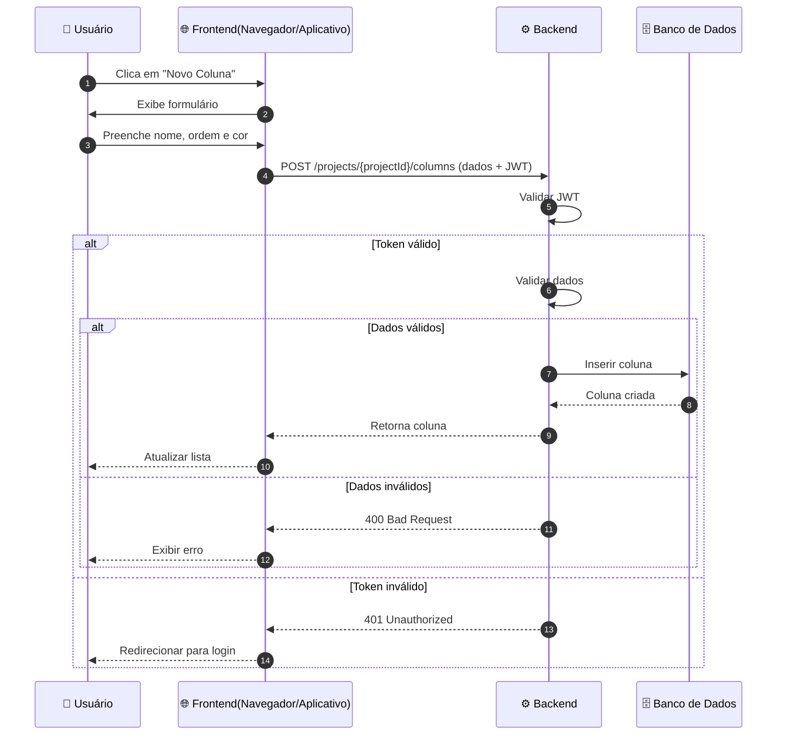
```mermaid
sequenceDiagram
    autonumber
    participant U as 👤 Usuário
    participant FE as 🌐 Frontend(Navegador/Aplicativo)
    participant API as ⚙️ Backend
    participant DB as 🗄️ Banco de Dados

    U->>FE: Clica em "Novo Coluna"
    FE->>U: Exibe formulário
    U->>FE: Preenche nome, ordem e cor
    FE->>API: POST /projects/{projectId}/columns (dados + JWT)
    API->>API: Validar JWT

    alt Token válido
        API->>API: Validar dados
        alt Dados válidos
            API->>DB: Inserir coluna
            DB-->>API: Coluna criada
            API-->>FE: Retorna coluna
            FE-->>U: Atualizar lista
        else Dados inválidos
            API-->>FE: 400 Bad Request
            FE-->>U: Exibir erro
        end
    else Token inválido
        API-->>FE: 401 Unauthorized
        FE-->>U: Redirecionar para login
    end
```

#### Editar coluna de status

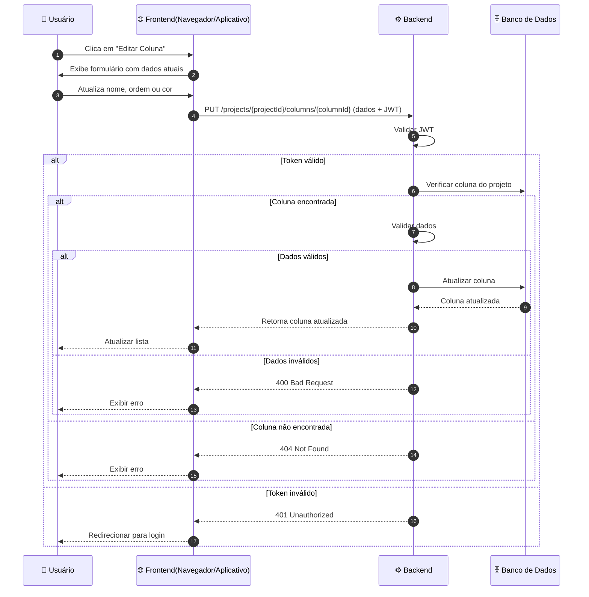
```mermaid
sequenceDiagram
    autonumber
    participant U as 👤 Usuário
    participant FE as 🌐 Frontend(Navegador/Aplicativo)
    participant API as ⚙️ Backend
    participant DB as 🗄️ Banco de Dados

    U->>FE: Clica em "Editar Coluna"
    FE->>U: Exibe formulário com dados atuais
    U->>FE: Atualiza nome, ordem ou cor
    FE->>API: PUT /projects/{projectId}/columns/{columnId} (dados + JWT)
    API->>API: Validar JWT

    alt Token válido
        API->>DB: Verificar coluna do projeto
        alt Coluna encontrada
            API->>API: Validar dados
            alt Dados válidos
                API->>DB: Atualizar coluna
                DB-->>API: Coluna atualizada
                API-->>FE: Retorna coluna atualizada
                FE-->>U: Atualizar lista
            else Dados inválidos
                API-->>FE: 400 Bad Request
                FE-->>U: Exibir erro
            end
        else Coluna não encontrada
            API-->>FE: 404 Not Found
            FE-->>U: Exibir erro
        end
    else Token inválido
        API-->>FE: 401 Unauthorized
        FE-->>U: Redirecionar para login
    end
```

#### Excluir coluna de status

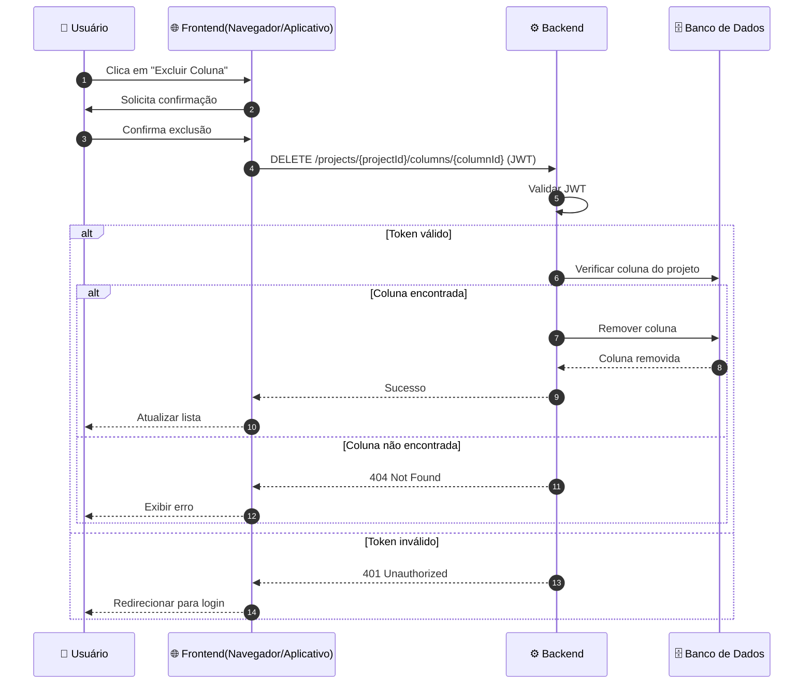
```mermaid
sequenceDiagram
    autonumber
    participant U as 👤 Usuário
    participant FE as 🌐 Frontend(Navegador/Aplicativo)
    participant API as ⚙️ Backend
    participant DB as 🗄️ Banco de Dados

    U->>FE: Clica em "Excluir Coluna"
    FE->>U: Solicita confirmação
    U->>FE: Confirma exclusão
    FE->>API: DELETE /projects/{projectId}/columns/{columnId} (JWT)
    API->>API: Validar JWT

    alt Token válido
        API->>DB: Verificar coluna do projeto
        alt Coluna encontrada
            API->>DB: Remover coluna
            DB-->>API: Coluna removida
            API-->>FE: Sucesso
            FE-->>U: Atualizar lista
        else Coluna não encontrada
            API-->>FE: 404 Not Found
            FE-->>U: Exibir erro
        end
    else Token inválido
        API-->>FE: 401 Unauthorized
        FE-->>U: Redirecionar para login
    end
```

### Tarefas (por projeto)

#### Listar tarefas

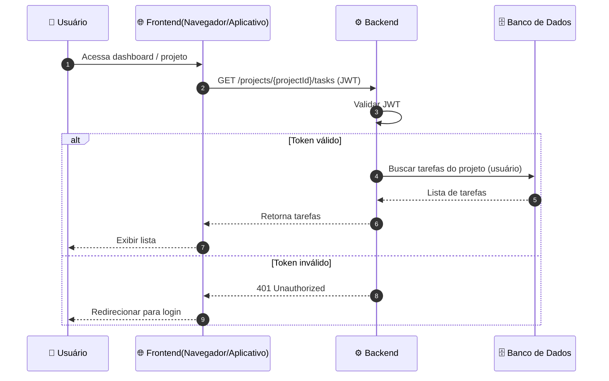
```mermaid
sequenceDiagram
    autonumber
    participant U as 👤 Usuário
    participant FE as 🌐 Frontend(Navegador/Aplicativo)
    participant API as ⚙️ Backend
    participant DB as 🗄️ Banco de Dados

    U->>FE: Acessa dashboard / projeto
    FE->>API: GET /projects/{projectId}/tasks (JWT)
    API->>API: Validar JWT

    alt Token válido
        API->>DB: Buscar tarefas do projeto (usuário)
        DB-->>API: Lista de tarefas
        API-->>FE: Retorna tarefas
        FE-->>U: Exibir lista
    else Token inválido
        API-->>FE: 401 Unauthorized
        FE-->>U: Redirecionar para login
    end
```

#### Criar tarefa

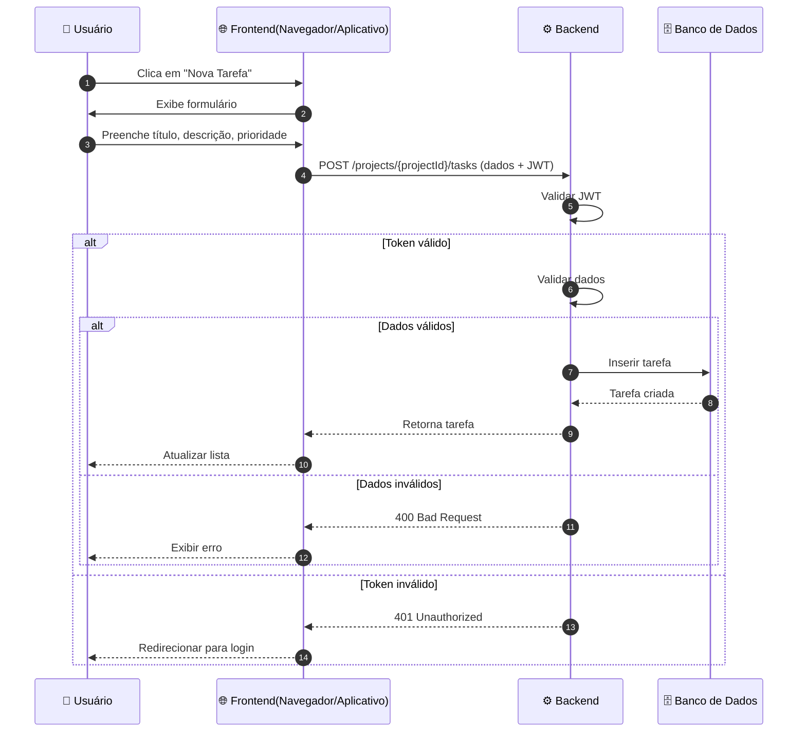
```mermaid
sequenceDiagram
    autonumber
    participant U as 👤 Usuário
    participant FE as 🌐 Frontend(Navegador/Aplicativo)
    participant API as ⚙️ Backend
    participant DB as 🗄️ Banco de Dados

    U->>FE: Clica em "Nova Tarefa"
    FE->>U: Exibe formulário
    U->>FE: Preenche título, descrição, prioridade
    FE->>API: POST /projects/{projectId}/tasks (dados + JWT)
    API->>API: Validar JWT

    alt Token válido
        API->>API: Validar dados
        alt Dados válidos
            API->>DB: Inserir tarefa
            DB-->>API: Tarefa criada
            API-->>FE: Retorna tarefa
            FE-->>U: Atualizar lista
        else Dados inválidos
            API-->>FE: 400 Bad Request
            FE-->>U: Exibir erro
        end
    else Token inválido
        API-->>FE: 401 Unauthorized
        FE-->>U: Redirecionar para login
    end
```

#### Editar tarefa

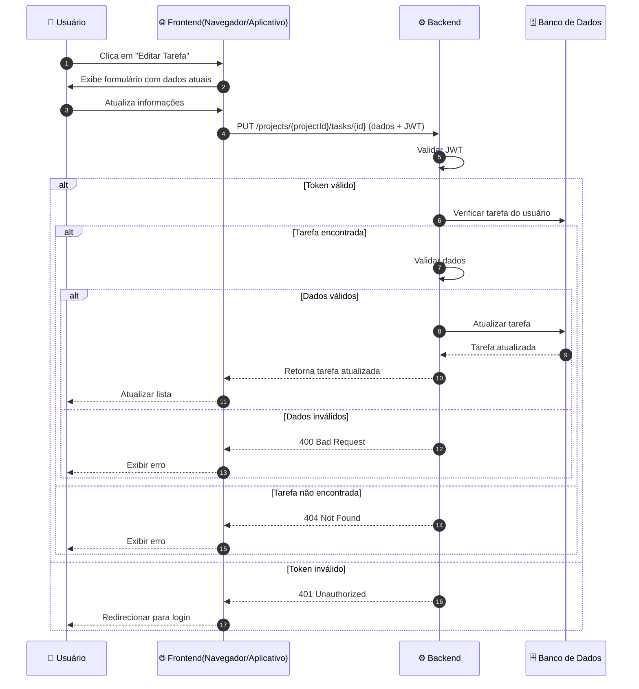
```mermaid
sequenceDiagram
    autonumber
    participant U as 👤 Usuário
    participant FE as 🌐 Frontend(Navegador/Aplicativo)
    participant API as ⚙️ Backend
    participant DB as 🗄️ Banco de Dados

    U->>FE: Clica em "Editar Tarefa"
    FE->>U: Exibe formulário com dados atuais
    U->>FE: Atualiza informações
    FE->>API: PUT /projects/{projectId}/tasks/{id} (dados + JWT)
    API->>API: Validar JWT

    alt Token válido
        API->>DB: Verificar tarefa do usuário
        alt Tarefa encontrada
            API->>API: Validar dados
            alt Dados válidos
                API->>DB: Atualizar tarefa
                DB-->>API: Tarefa atualizada
                API-->>FE: Retorna tarefa atualizada
                FE-->>U: Atualizar lista
            else Dados inválidos
                API-->>FE: 400 Bad Request
                FE-->>U: Exibir erro
            end
        else Tarefa não encontrada
            API-->>FE: 404 Not Found
            FE-->>U: Exibir erro
        end
    else Token inválido
        API-->>FE: 401 Unauthorized
        FE-->>U: Redirecionar para login
    end
```

#### Excluir tarefa

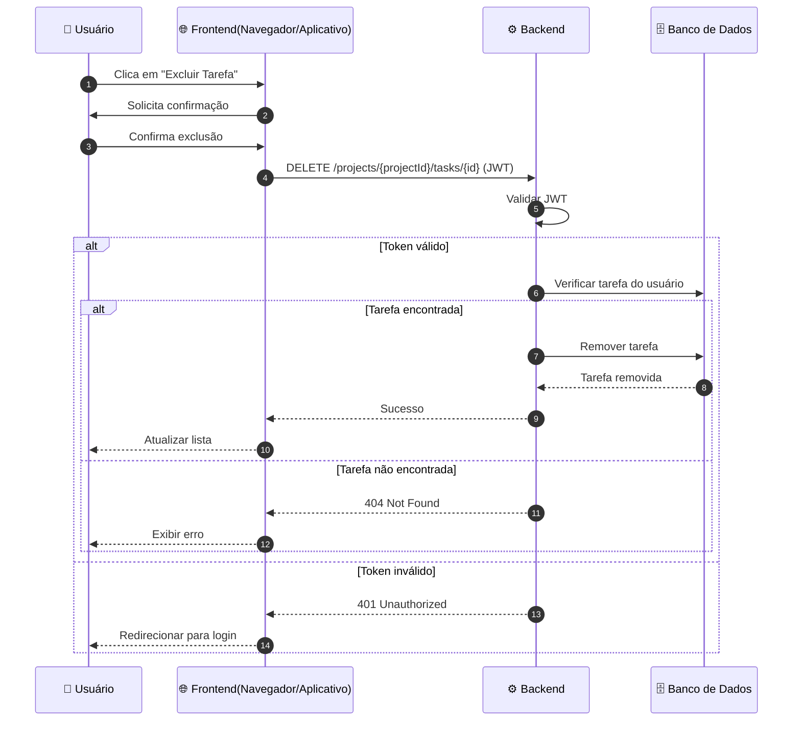
```mermaid
sequenceDiagram
    autonumber
    participant U as 👤 Usuário
    participant FE as 🌐 Frontend(Navegador/Aplicativo)
    participant API as ⚙️ Backend
    participant DB as 🗄️ Banco de Dados

    U->>FE: Clica em "Excluir Tarefa"
    FE->>U: Solicita confirmação
    U->>FE: Confirma exclusão
    FE->>API: DELETE /projects/{projectId}/tasks/{id} (JWT)
    API->>API: Validar JWT

    alt Token válido
        API->>DB: Verificar tarefa do usuário
        alt Tarefa encontrada
            API->>DB: Remover tarefa
            DB-->>API: Tarefa removida
            API-->>FE: Sucesso
            FE-->>U: Atualizar lista
        else Tarefa não encontrada
            API-->>FE: 404 Not Found
            FE-->>U: Exibir erro
        end
    else Token inválido
        API-->>FE: 401 Unauthorized
        FE-->>U: Redirecionar para login
    end
```

#### Alterar coluna de status da tarefa

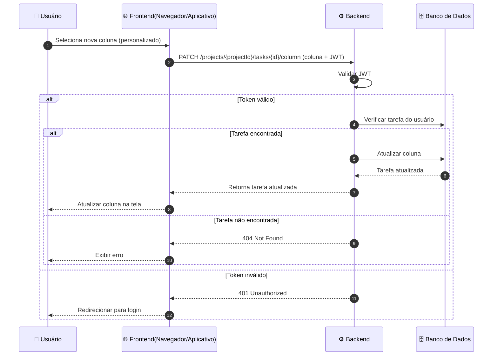
```mermaid
sequenceDiagram
    autonumber
    participant U as 👤 Usuário
    participant FE as 🌐 Frontend(Navegador/Aplicativo)
    participant API as ⚙️ Backend
    participant DB as 🗄️ Banco de Dados

    U->>FE: Seleciona nova coluna (personalizado)
    FE->>API: PATCH /projects/{projectId}/tasks/{id}/column (coluna + JWT)
    API->>API: Validar JWT

    alt Token válido
        API->>DB: Verificar tarefa do usuário
        alt Tarefa encontrada
            API->>DB: Atualizar coluna
            DB-->>API: Tarefa atualizada
            API-->>FE: Retorna tarefa atualizada
            FE-->>U: Atualizar coluna na tela
        else Tarefa não encontrada
            API-->>FE: 404 Not Found
            FE-->>U: Exibir erro
        end
    else Token inválido
        API-->>FE: 401 Unauthorized
        FE-->>U: Redirecionar para login
    end
```

#### Alterar prioridade da tarefa

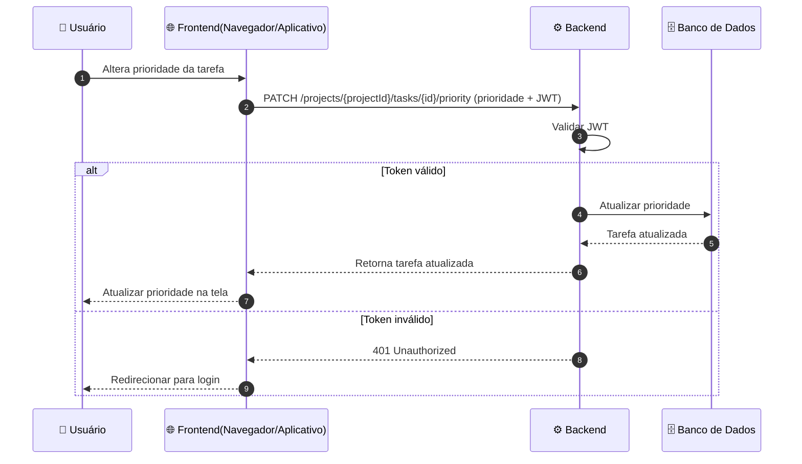
```mermaid
sequenceDiagram
    autonumber
    participant U as 👤 Usuário
    participant FE as 🌐 Frontend(Navegador/Aplicativo)
    participant API as ⚙️ Backend
    participant DB as 🗄️ Banco de Dados

    U->>FE: Altera prioridade da tarefa
    FE->>API: PATCH /projects/{projectId}/tasks/{id}/priority (prioridade + JWT)
    API->>API: Validar JWT

    alt Token válido
        API->>DB: Atualizar prioridade
        DB-->>API: Tarefa atualizada
        API-->>FE: Retorna tarefa atualizada
        FE-->>U: Atualizar prioridade na tela
    else Token inválido
        API-->>FE: 401 Unauthorized
        FE-->>U: Redirecionar para login
    end
```

### Configurações

#### Atualizar perfil

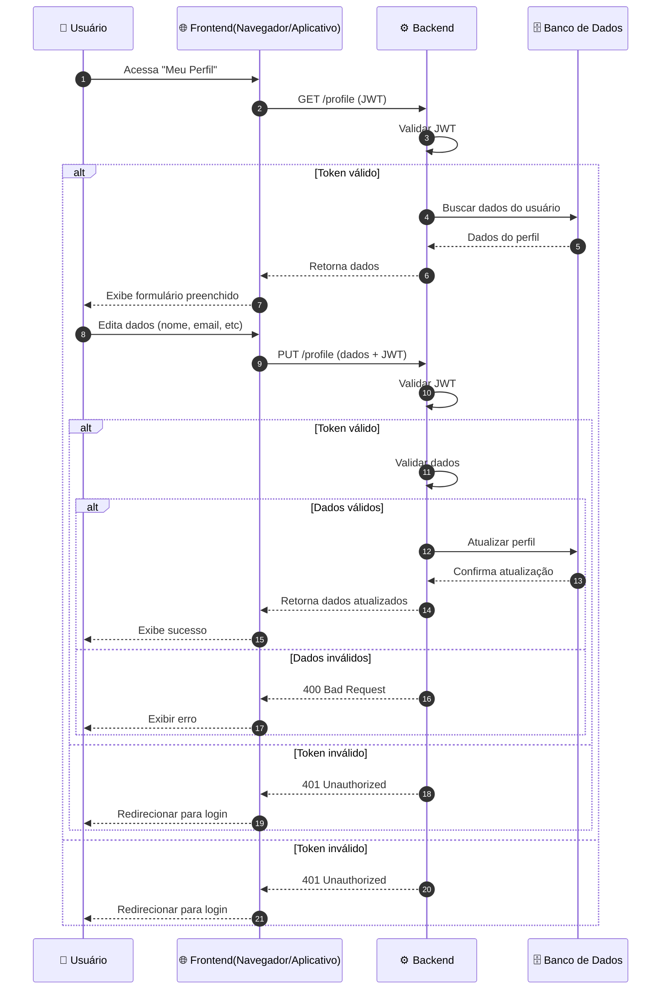
```mermaid
sequenceDiagram
    autonumber
    participant U as 👤 Usuário
    participant FE as 🌐 Frontend(Navegador/Aplicativo)
    participant API as ⚙️ Backend
    participant DB as 🗄️ Banco de Dados

    U->>FE: Acessa "Meu Perfil"
    FE->>API: GET /profile (JWT)
    API->>API: Validar JWT

    alt Token válido
        API->>DB: Buscar dados do usuário
        DB-->>API: Dados do perfil
        API-->>FE: Retorna dados
        FE-->>U: Exibe formulário preenchido

        U->>FE: Edita dados (nome, email, etc)
        FE->>API: PUT /profile (dados + JWT)
        API->>API: Validar JWT

        alt Token válido
            API->>API: Validar dados

            alt Dados válidos
                API->>DB: Atualizar perfil
                DB-->>API: Confirma atualização
                API-->>FE: Retorna dados atualizados
                FE-->>U: Exibe sucesso
            else Dados inválidos
                API-->>FE: 400 Bad Request
                FE-->>U: Exibir erro
            end

        else Token inválido
            API-->>FE: 401 Unauthorized
            FE-->>U: Redirecionar para login
        end

    else Token inválido
        API-->>FE: 401 Unauthorized
        FE-->>U: Redirecionar para login
    end
```

#### Trocar senha

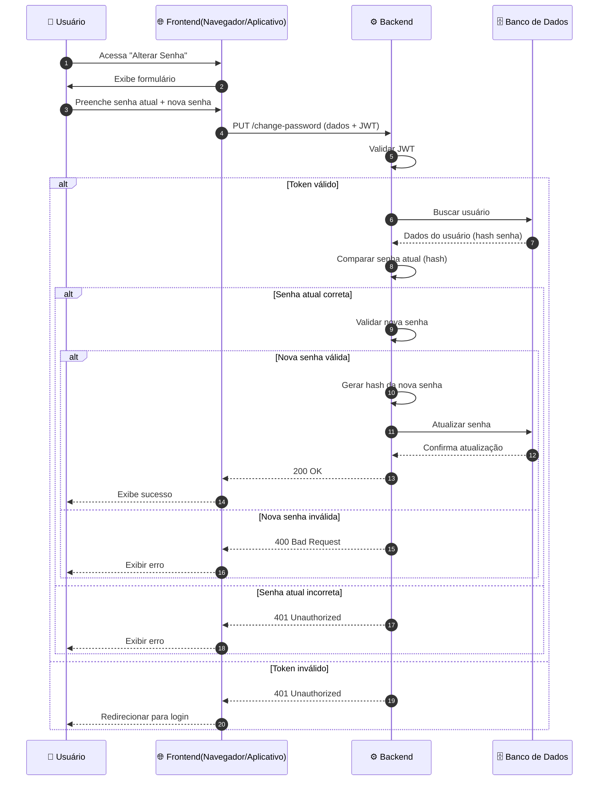
```mermaid
sequenceDiagram
    autonumber
    participant U as 👤 Usuário
    participant FE as 🌐 Frontend(Navegador/Aplicativo)
    participant API as ⚙️ Backend
    participant DB as 🗄️ Banco de Dados

    U->>FE: Acessa "Alterar Senha"
    FE->>U: Exibe formulário

    U->>FE: Preenche senha atual + nova senha
    FE->>API: PUT /change-password (dados + JWT)
    API->>API: Validar JWT

    alt Token válido
        API->>DB: Buscar usuário
        DB-->>API: Dados do usuário (hash senha)

        API->>API: Comparar senha atual (hash)

        alt Senha atual correta
            API->>API: Validar nova senha

            alt Nova senha válida
                API->>API: Gerar hash da nova senha
                API->>DB: Atualizar senha
                DB-->>API: Confirma atualização

                API-->>FE: 200 OK
                FE-->>U: Exibe sucesso

            else Nova senha inválida
                API-->>FE: 400 Bad Request
                FE-->>U: Exibir erro
            end

        else Senha atual incorreta
            API-->>FE: 401 Unauthorized
            FE-->>U: Exibir erro
        end

    else Token inválido
        API-->>FE: 401 Unauthorized
        FE-->>U: Redirecionar para login
    end
```
