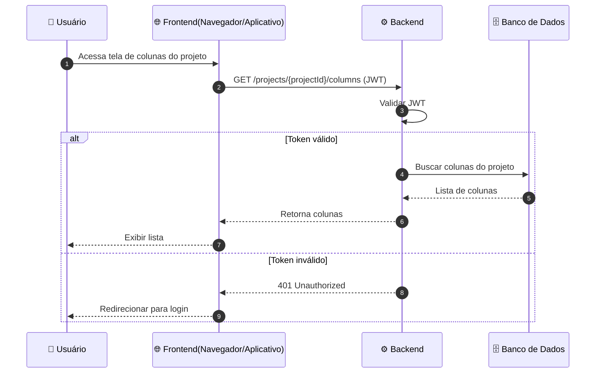
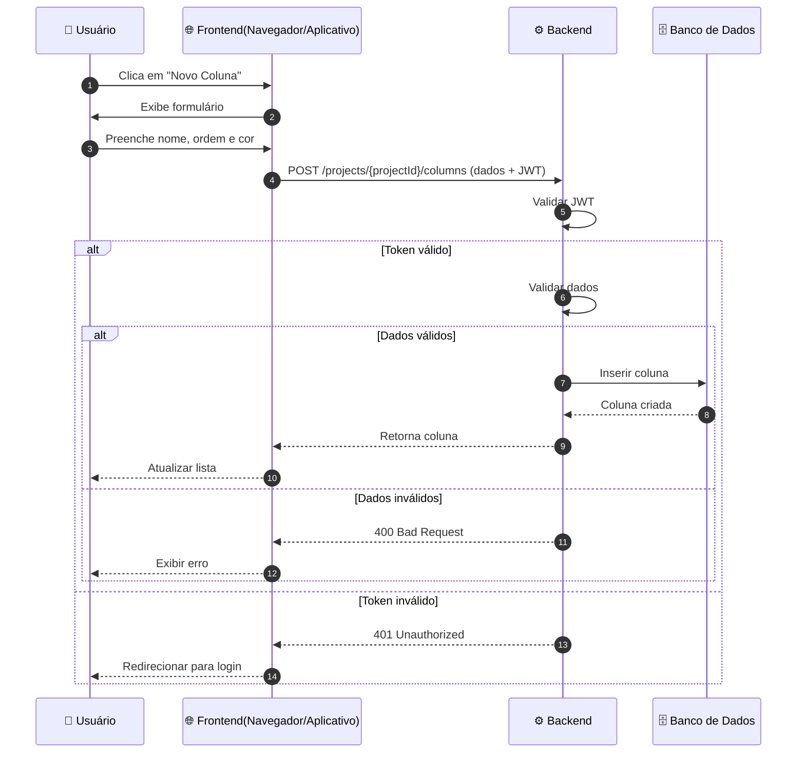
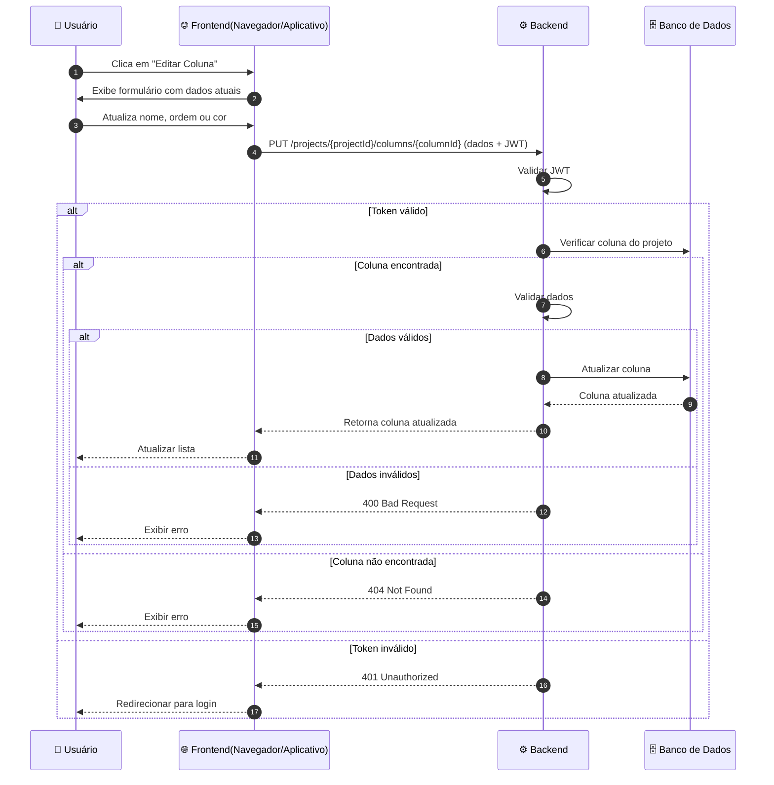
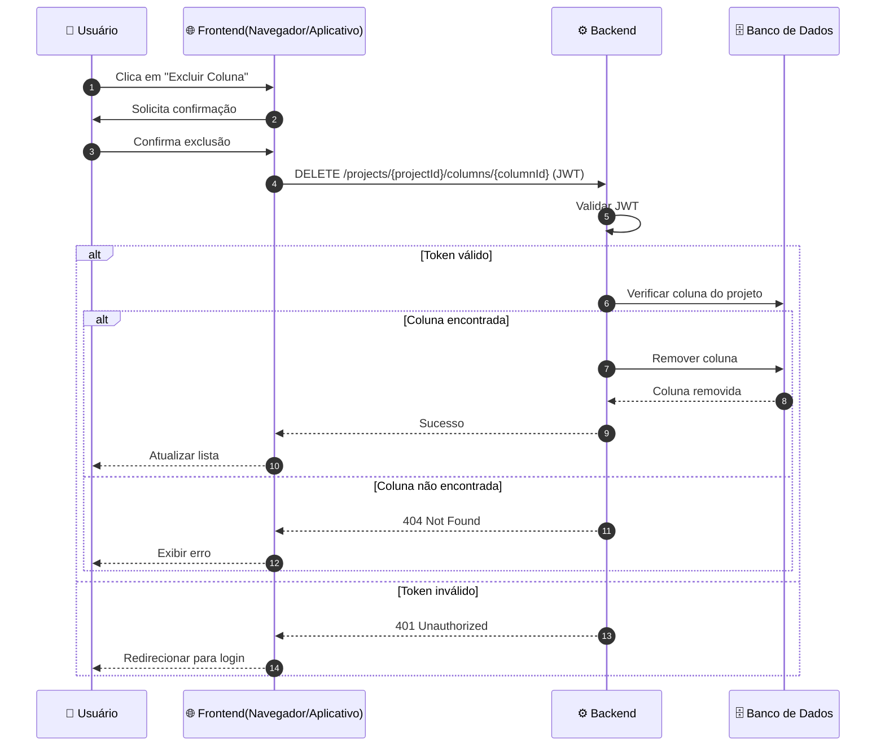

Voltar para [🔄 Diagramas de Sequência](../index.md)

---

[Início](../../../../README.md) | [📊 Diagramas](../../index.md) | [🔄 Diagramas de Sequência](../index.md) | Colunas (por projeto)

---

## Colunas (por projeto)

### Listar colunas de status

### Criar coluna de status

### Editar coluna de status

### Excluir coluna de status

