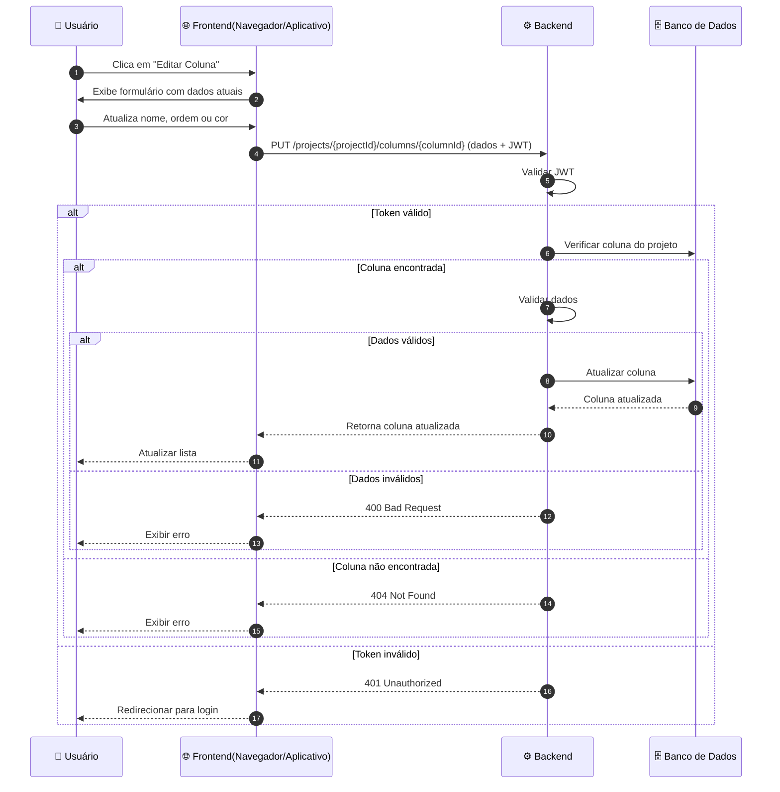

Voltar para [Colunas (por projeto)](../index.md)

---

[Início](../../../../../README.md) | [📊 Diagramas](../../../index.md) | [🔄 Diagramas de Sequência](../../index.md) | [Colunas (por projeto)](../index.md) | Editar coluna de status

---

## Editar coluna de status

