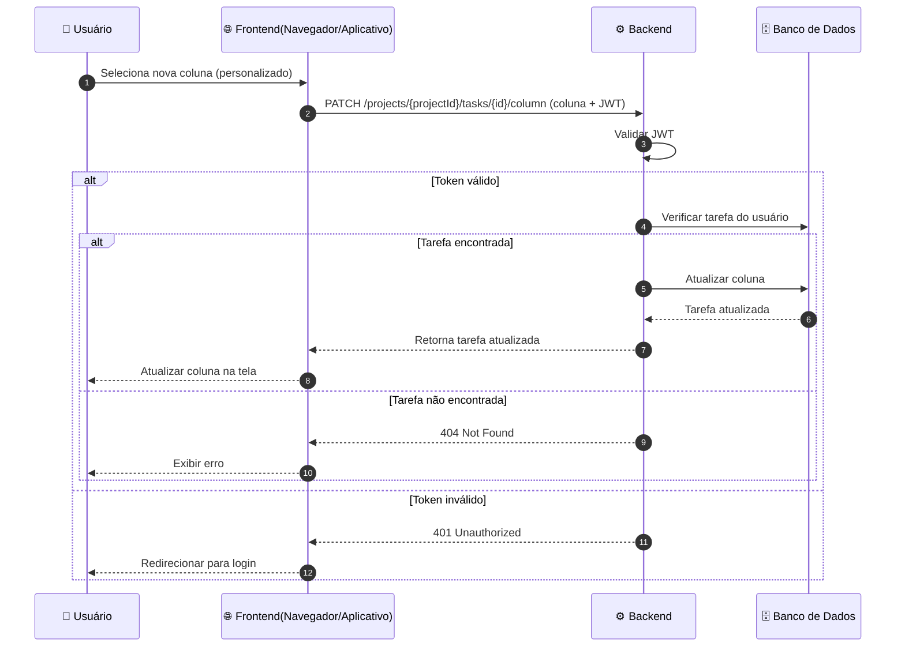

Voltar para [Tarefas (por projeto)](../index.md)

---

[Início](../../../../../README.md) | [📊 Diagramas](../../../index.md) | [🔄 Diagramas de Sequência](../../index.md) | [Tarefas (por projeto)](../index.md) | Alterar coluna de status da tarefa

---

## Alterar coluna de status da tarefa

