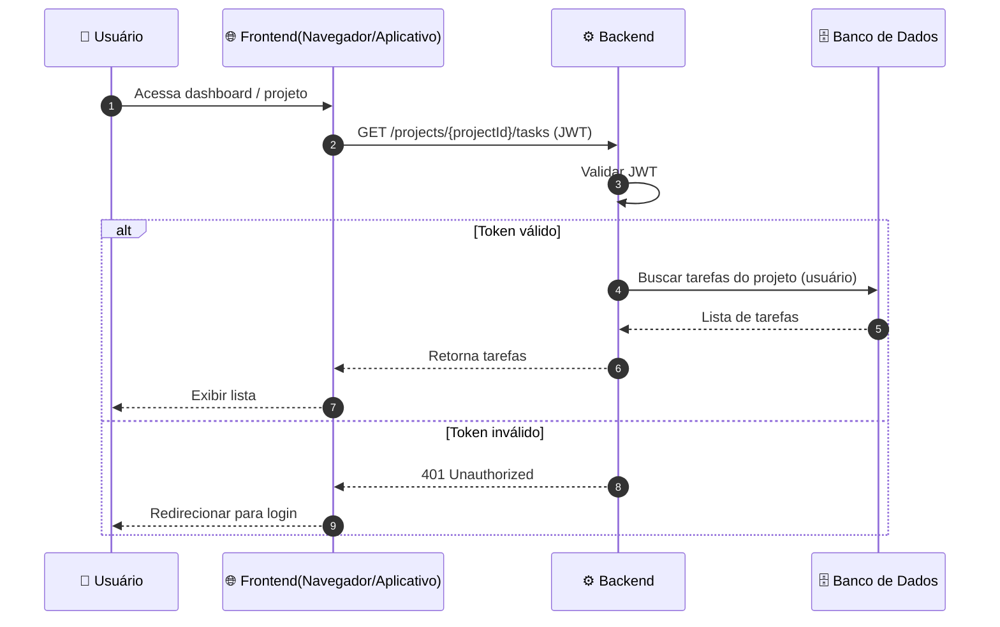
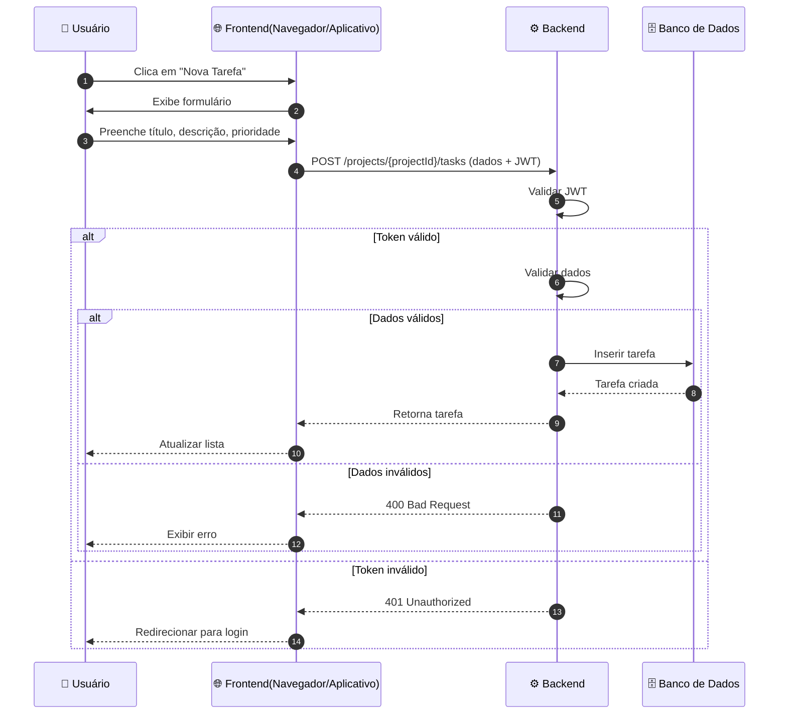
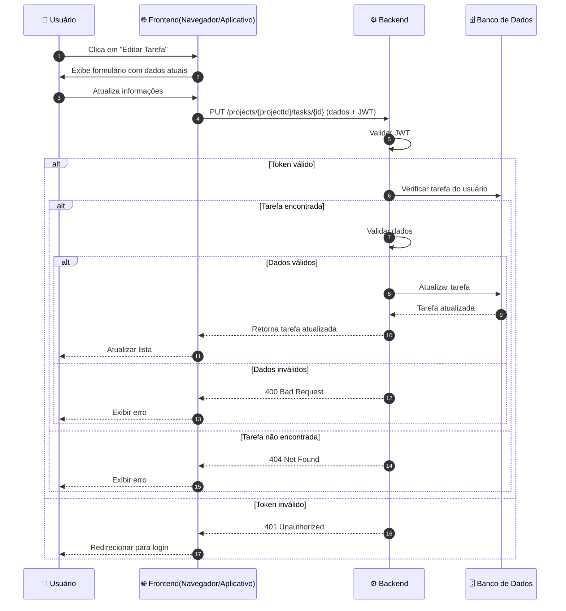
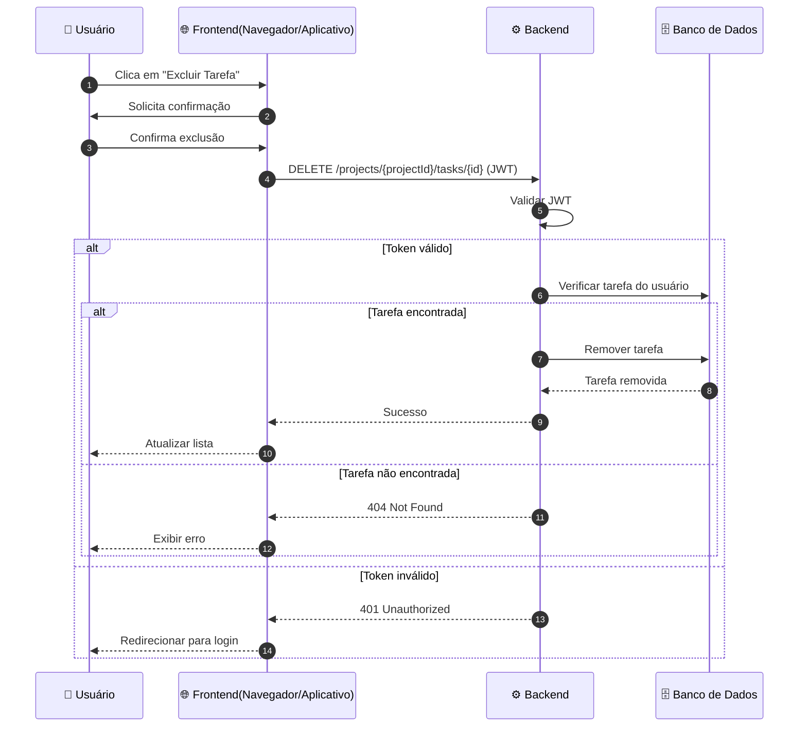
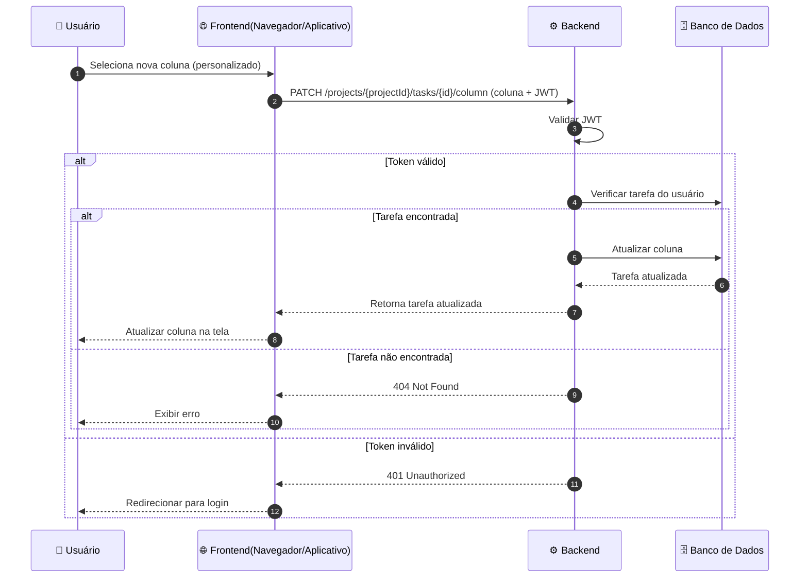
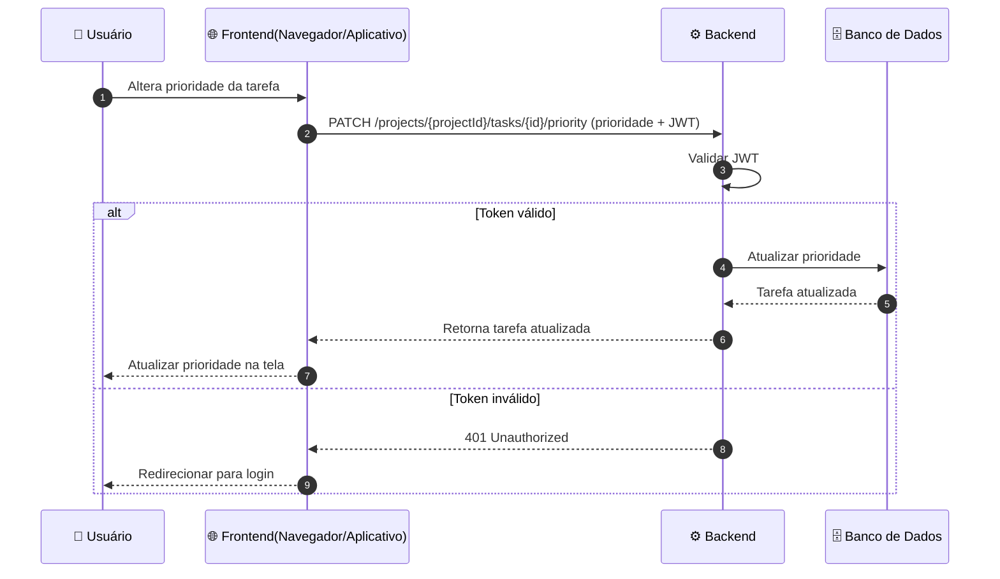

Voltar para [🔄 Diagramas de Sequência](../index.md)

---

[Início](../../../../README.md) | [📊 Diagramas](../../index.md) | [🔄 Diagramas de Sequência](../index.md) | Tarefas (por projeto)

---

## Tarefas (por projeto)

### Listar tarefas

### Criar tarefa

### Editar tarefa

### Excluir tarefa

### Alterar coluna de status da tarefa

### Alterar prioridade da tarefa

