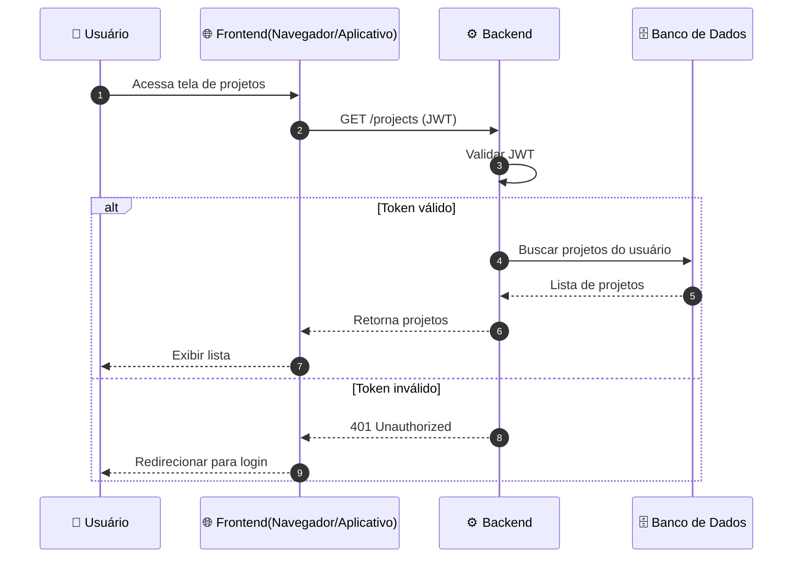
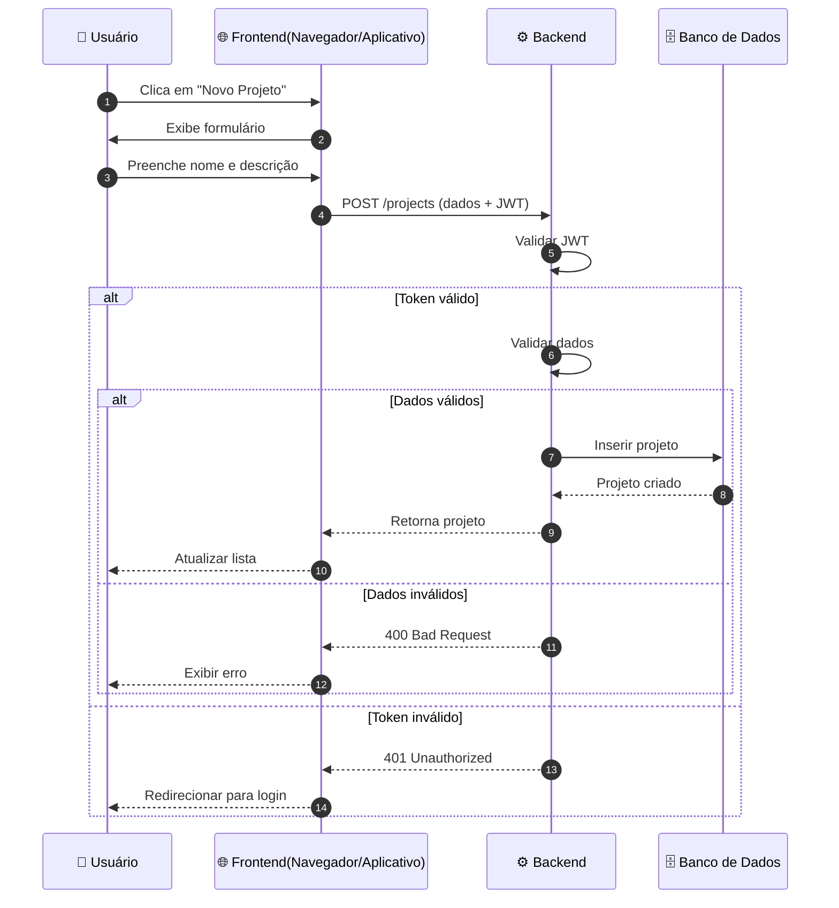
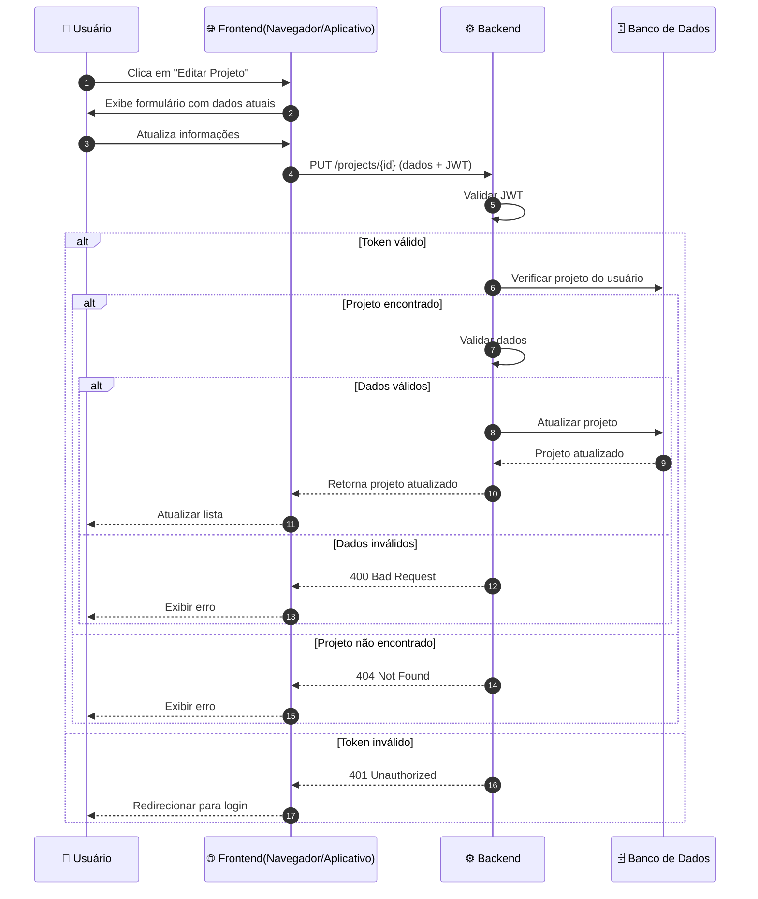
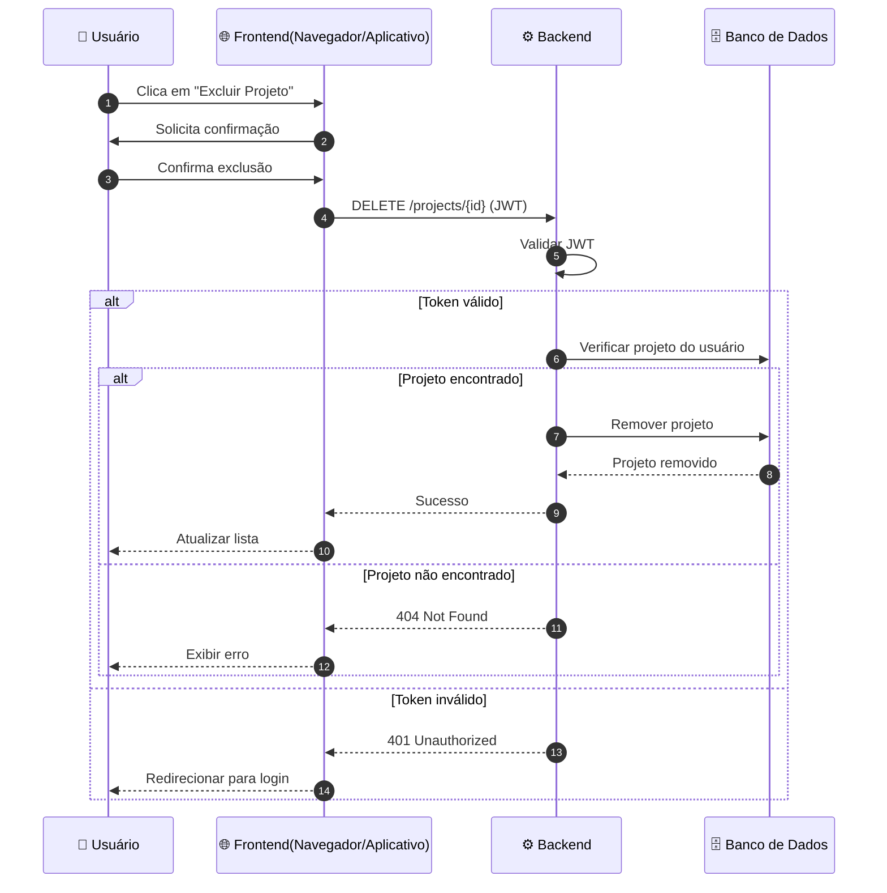

Voltar para [🔄 Diagramas de Sequência](../index.md)

---

[Início](../../../../README.md) | [📊 Diagramas](../../index.md) | [🔄 Diagramas de Sequência](../index.md) | Projetos

---

## Projetos

### Listar projetos

### Criar projeto

### Editar projeto

### Excluir projeto

