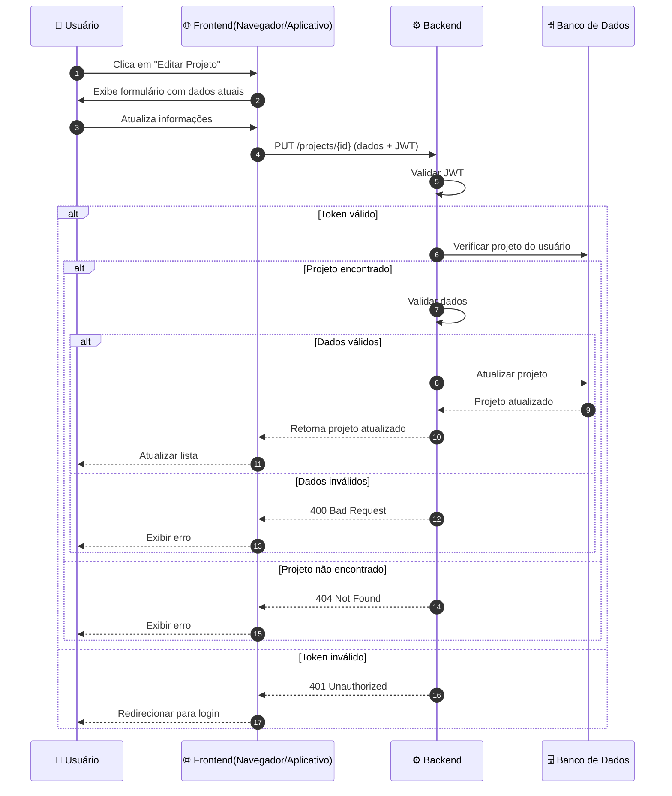

Voltar para [Projetos](../index.md)

---

[Início](../../../../../README.md) | [📊 Diagramas](../../../index.md) | [🔄 Diagramas de Sequência](../../index.md) | [Projetos](../index.md) | Editar projeto

---

## Editar projeto

