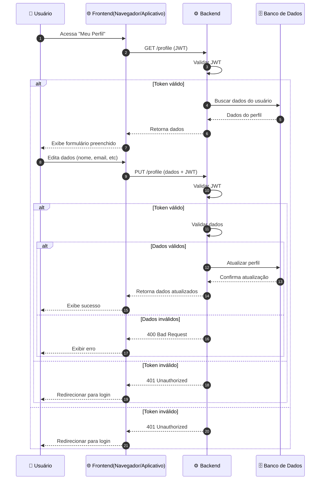
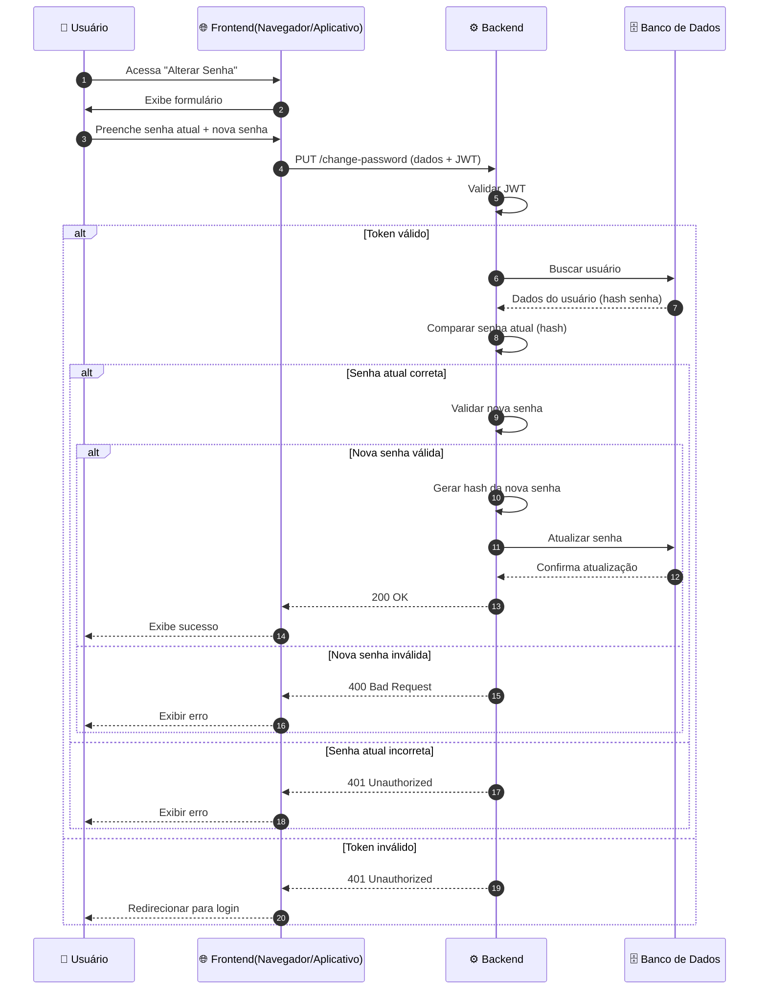

Voltar para [🔄 Diagramas de Sequência](../index.md)

---

[Início](../../../../README.md) | [📊 Diagramas](../../index.md) | [🔄 Diagramas de Sequência](../index.md) | Configurações

---

## Configurações

### Atualizar perfil

### Trocar senha

