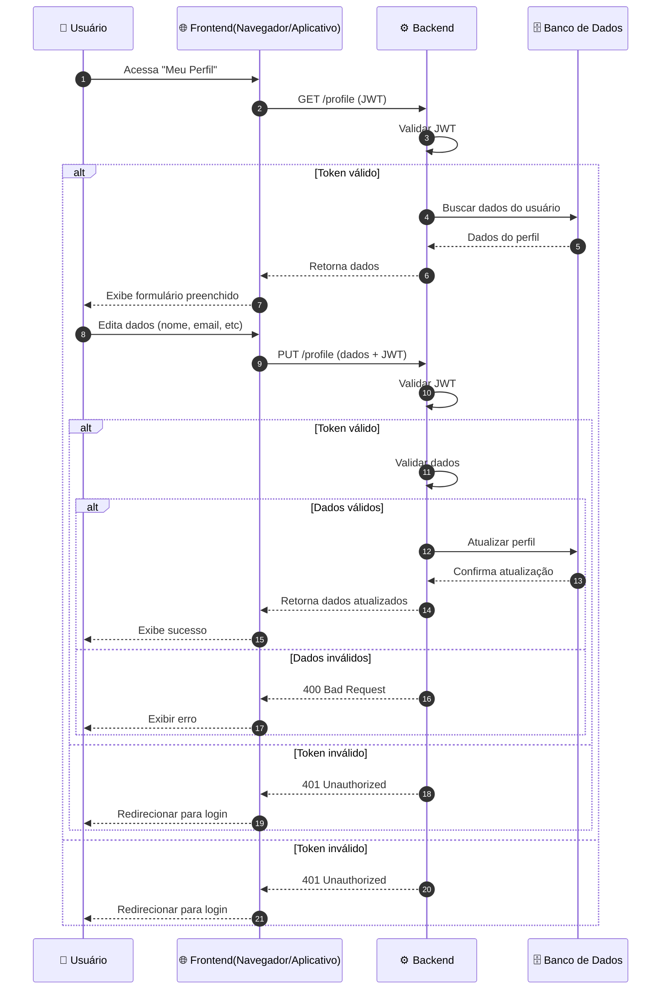

Voltar para [Configurações](../index.md)

---

[Início](../../../../../README.md) | [📊 Diagramas](../../../index.md) | [🔄 Diagramas de Sequência](../../index.md) | [Configurações](../index.md) | Atualizar perfil

---

## Atualizar perfil

