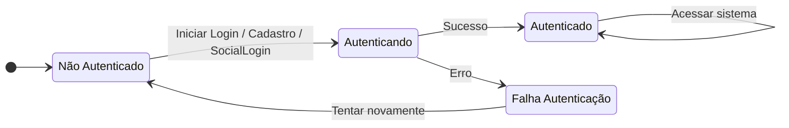
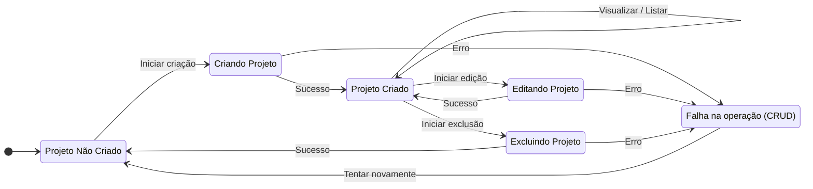
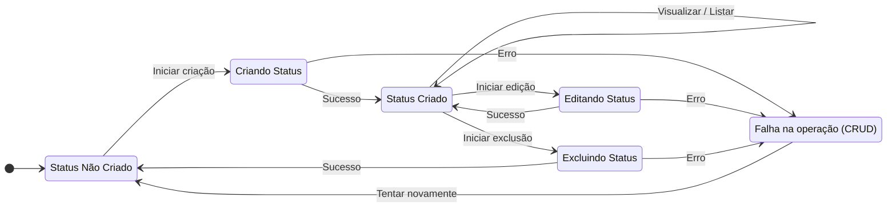
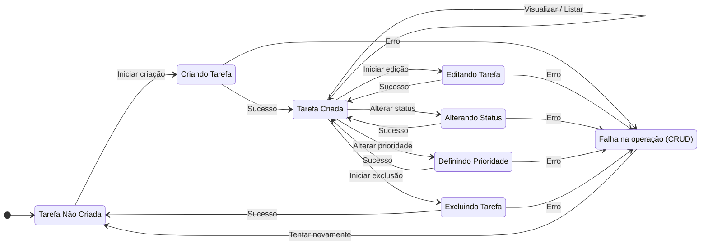

← Voltar para [Diagramas](../diagrams.md)

## 🧠 Diagramas de Estados

### Autenticação

- Descrição do Diagrama:
  - Não Autenticado: Estado inicial do usuário antes de realizar qualquer ação de login.
  - Autenticando: Estado temporário enquanto o sistema processa o login, cadastro ou autenticação social.
  - Autenticado: Estado final quando o usuário realiza login com sucesso.
  - Falha Autenticação: Estado que indica que ocorreu um erro no login, senha incorreta ou falha na autenticação social.
- Transições:
  - O usuário passa de Não Autenticado para Autenticando ao iniciar qualquer processo de autenticação.
  - Se o processo for bem-sucedido, vai para Autenticado.
  - Se houver erro, vai para Falha Autenticação, que permite tentar novamente voltando a Não Autenticado.

### Projetos

- Descrição do Diagrama:
  - Não Criado: Estado inicial, nenhum projeto existe.
  - Criando Projeto / Editando Projeto / Excluindo Projeto: Estados temporários durante a operação.
  - Projeto Criado: Projeto existente e disponível para ações.
  - Falha na operação (CRUD): Indica erro em qualquer operação de CRUD.
- Transições:
  - Permitem tentar novamente após falha ou avançar em caso de sucesso.

### Status do Projeto

- Descrição do Diagrama:
  - Não Criado: Estado inicial, nenhum status existe no projeto.
  - Criando Status / Editando Status / Excluindo Status: Estados temporários enquanto a ação é processada.
  - Status Criado: Status disponível no projeto.
  - Falha na operação (CRUD): Indica erro durante qualquer operação de CRUD.

- Transições:
  - Sempre permitem voltar a tentar após falha, ou avançar em caso de sucesso.

### Tarefas

- Descrição do Diagrama:
  - Não Criada: Estado inicial, nenhuma tarefa existe.
  - Criando / Editando / Alterando Status / Definindo Prioridade / Excluindo: Estados temporários de operação.
  - Tarefa Criada: Tarefa existente pronta para qualquer ação.
  - Falha na operação (CRUD): Indica erro em qualquer operação de CRUD ou alteração.
- Transições:
  - Permitem avançar em caso de sucesso ou tentar novamente após falha.
