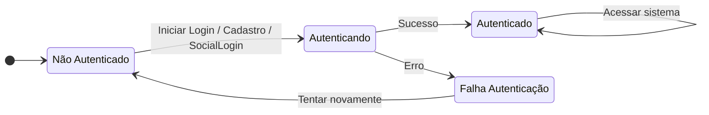

Voltar para [🧠 Diagramas de Estados](../index.md)

---

[Início](../../../../README.md) | [📊 Diagramas](../../index.md) | [🧠 Diagramas de Estados](../index.md) | Autenticação

---

## Autenticação

- Descrição do Diagrama:
  - Não Autenticado: Estado inicial do usuário antes de realizar qualquer ação de login.
  - Autenticando: Estado temporário enquanto o sistema processa o login, cadastro ou autenticação social.
  - Autenticado: Estado final quando o usuário realiza login com sucesso.
  - Falha Autenticação: Estado que indica que ocorreu um erro no login, senha incorreta ou falha na autenticação social.
- Transições:
  - O usuário passa de Não Autenticado para Autenticando ao iniciar qualquer processo de autenticação.
  - Se o processo for bem-sucedido, vai para Autenticado.
  - Se houver erro, vai para Falha Autenticação, que permite tentar novamente voltando a Não Autenticado.
