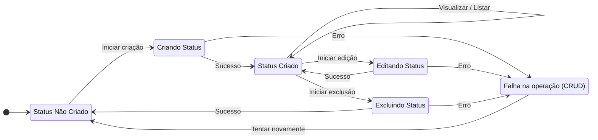

Voltar para [🧠 Diagramas de Estados](../index.md)

---

[Início](../../../../README.md) | [📊 Diagramas](../../index.md) | [🧠 Diagramas de Estados](../index.md) | Colunas (por projeto)

---

## Colunas (por projeto)

- Descrição do Diagrama:
  - Não Criado: Estado inicial, nenhum status existe no projeto.
  - Criando Status / Editando Status / Excluindo Status: Estados temporários enquanto a ação é processada.
  - Status Criado: Status disponível no projeto.
  - Falha na operação (CRUD): Indica erro durante qualquer operação de CRUD.

- Transições:
  - Sempre permitem voltar a tentar após falha, ou avançar em caso de sucesso.
