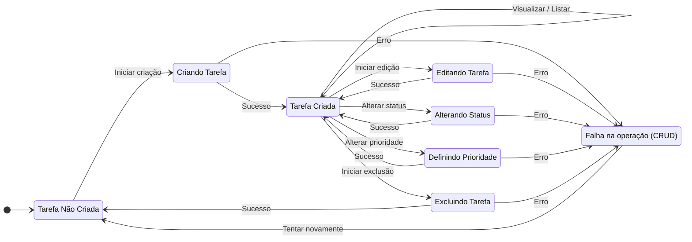

Voltar para [🧠 Diagramas de Estados](../index.md)

---

[Início](../../../../README.md) | [📊 Diagramas](../../index.md) | [🧠 Diagramas de Estados](../index.md) | Tarefas (por projeto)

---

## Tarefas (por projeto)

- Descrição do Diagrama:
  - Não Criada: Estado inicial, nenhuma tarefa existe.
  - Criando / Editando / Alterando Status / Definindo Prioridade / Excluindo: Estados temporários de operação.
  - Tarefa Criada: Tarefa existente pronta para qualquer ação.
  - Falha na operação (CRUD): Indica erro em qualquer operação de CRUD ou alteração.
- Transições:
  - Permitem avançar em caso de sucesso ou tentar novamente após falha.
