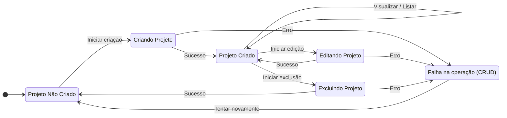

Voltar para [🧠 Diagramas de Estados](../index.md)

---

[Início](../../../../README.md) | [📊 Diagramas](../../index.md) | [🧠 Diagramas de Estados](../index.md) | Projetos

---

## Projetos

- Descrição do Diagrama:
  - Não Criado: Estado inicial, nenhum projeto existe.
  - Criando Projeto / Editando Projeto / Excluindo Projeto: Estados temporários durante a operação.
  - Projeto Criado: Projeto existente e disponível para ações.
  - Falha na operação (CRUD): Indica erro em qualquer operação de CRUD.
- Transições:
  - Permitem tentar novamente após falha ou avançar em caso de sucesso.
