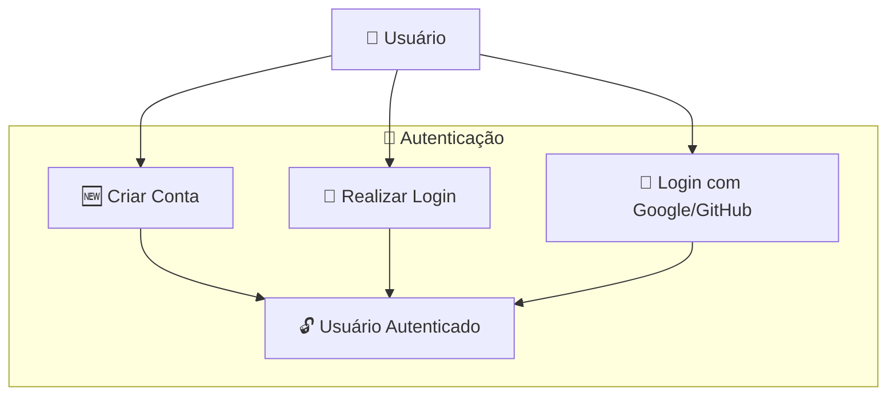
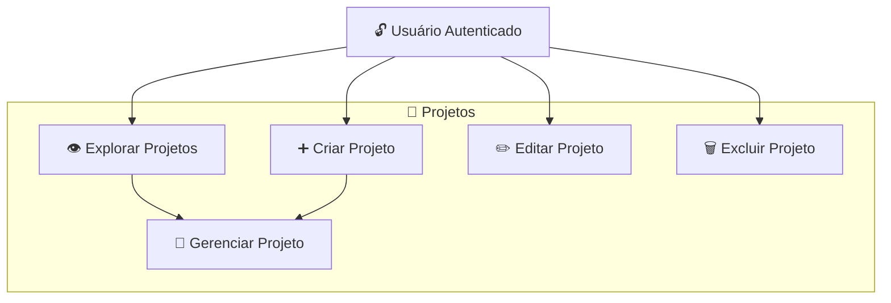
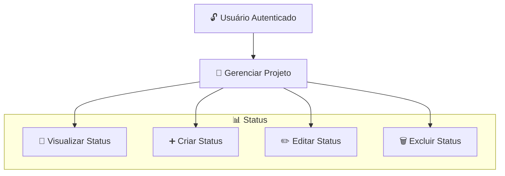
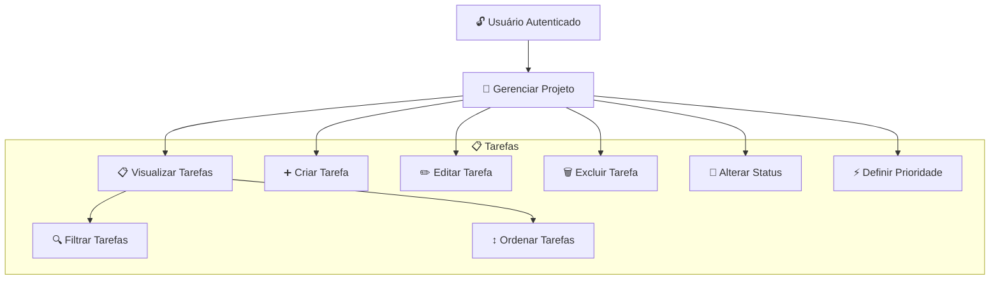
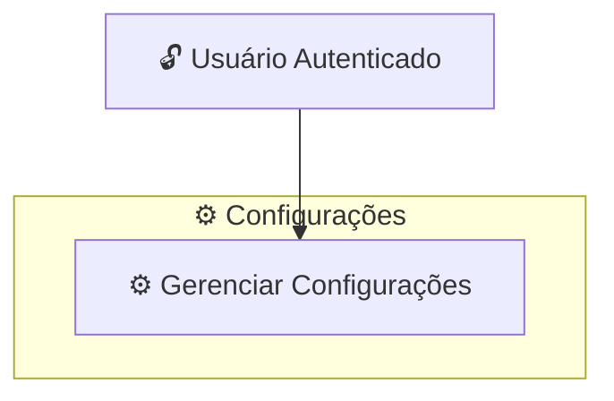

## 📌 Diagrama de Casos de Uso

### Diagrama de Autenticação

```mermaid id="seq-authentication"
graph TD

    User[👤 Usuário]

    %% Autenticação
    subgraph AUTH[🔐 Autenticação]
        Register[🆕 Criar Conta]
        Login[🔐 Realizar Login]
        SocialLogin[🔗 Login com Google/GitHub]
        Authenticated[🔓 Usuário Autenticado]
    end

    User --> Register
    User --> Login
    User --> SocialLogin

    Register --> Authenticated
    Login --> Authenticated
    SocialLogin --> Authenticated
```

### Diagrama de Funcionalidades da aplicação

#### Projetos

```mermaid id="seq-app-functions-projects"
graph TD

    Authenticated[🔓 Usuário Autenticado]

    %% Projetos
    subgraph PROJECTS[📁 Projetos]
        BrowseProjects[👁️ Explorar Projetos]
        ManageProject[📁 Gerenciar Projeto]
        CreateProject[➕ Criar Projeto]
        EditProject[✏️ Editar Projeto]
        DeleteProject[🗑️ Excluir Projeto]
    end

    Authenticated --> BrowseProjects
    Authenticated --> CreateProject
    Authenticated --> EditProject
    Authenticated --> DeleteProject

    BrowseProjects --> ManageProject
    CreateProject --> ManageProject
```

#### Status (por projeto)

```mermaid id="seq-app-functions-status-project"
graph TD

    Authenticated[🔓 Usuário Autenticado]
    ManageProject[📁 Gerenciar Projeto]

    %% Status (por projeto)
    subgraph PROJECT_STATUS[📊 Status]
        ViewStatus[📂 Visualizar Status]
        CreateStatus[➕ Criar Status]
        EditStatus[✏️ Editar Status]
        DeleteStatus[🗑️ Excluir Status]
    end

    Authenticated --> ManageProject

    ManageProject --> ViewStatus
    ManageProject --> CreateStatus
    ManageProject --> EditStatus
    ManageProject --> DeleteStatus
```

#### Tarefas

```mermaid id="seq-app-functions-tasks"
graph TD

    Authenticated[🔓 Usuário Autenticado]
    ManageProject[📁 Gerenciar Projeto]

    %% Tarefas
    subgraph TASKS[📋 Tarefas]
        ViewTasks[📋 Visualizar Tarefas]
        CreateTask[➕ Criar Tarefa]
        EditTask[✏️ Editar Tarefa]
        DeleteTask[🗑️ Excluir Tarefa]
        ChangeStatus[🔄 Alterar Status]
        FilterTasks[🔍 Filtrar Tarefas]
        SortTasks[↕️ Ordenar Tarefas]
        SetPriority[⚡ Definir Prioridade]
    end

    Authenticated --> ManageProject

    ManageProject --> ViewTasks
    ManageProject --> CreateTask
    ManageProject --> EditTask
    ManageProject --> DeleteTask
    ManageProject --> ChangeStatus
    ManageProject --> SetPriority

    ViewTasks --> FilterTasks
    ViewTasks --> SortTasks
```

#### Configurações

```mermaid id="seq-app-functions-settings"
graph TD

    Authenticated[🔓 Usuário Autenticado]

    %% Configurações
    subgraph SETTINGS[⚙️ Configurações]
        Settings[⚙️ Gerenciar Configurações]
    end

    Authenticated --> Settings
```
