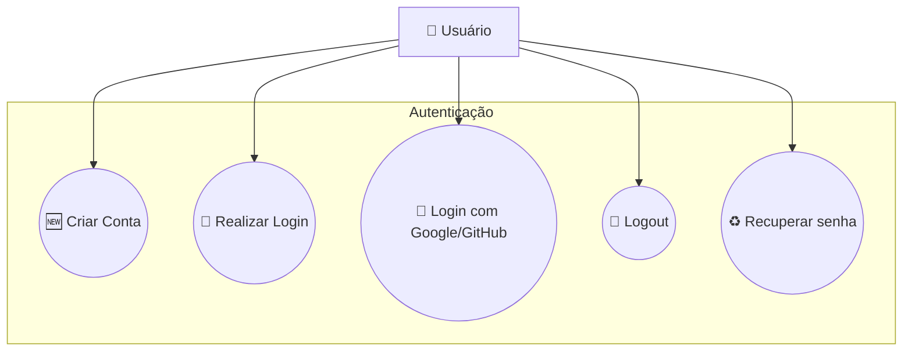

← [Voltar para Casos de Uso](./README.md)

---

[Início](../../../README.md) / [Diagramas](../README.md) / [Casos de Uso](./README.md) / Autenticação

---

## Autenticação

```mermaid
graph TD

    User[👤 Usuário]

    %% Autenticação
    subgraph AUTH[Autenticação]
        Register((🆕 Criar Conta))
        Login((🔐 Realizar Login))
        SocialLogin((🔗 Login com Google/GitHub))
        Logout((🚪 Logout))
        RecoverPassword((♻️ Recuperar senha))
    end

    User --> Register
    User --> Login
    User --> SocialLogin
    User --> Logout
    User --> RecoverPassword
```
