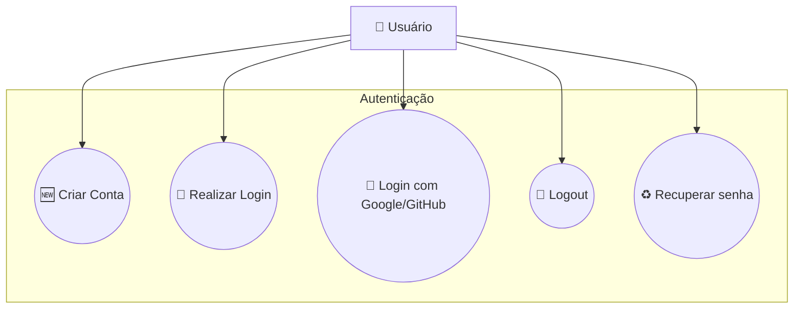
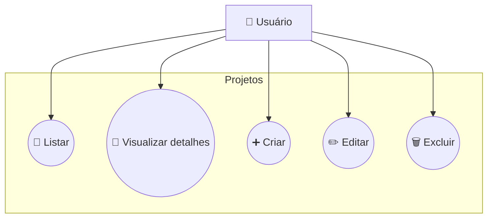
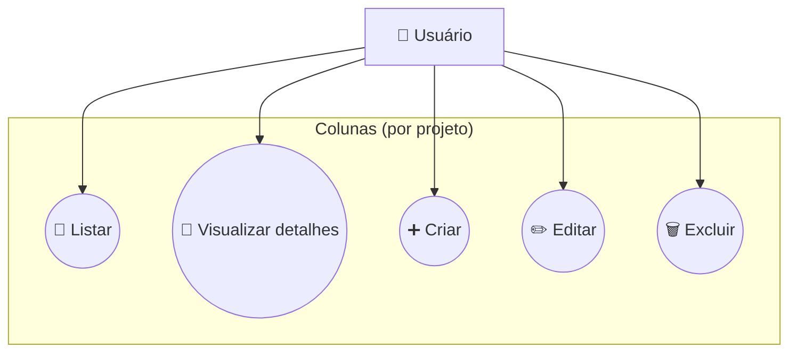
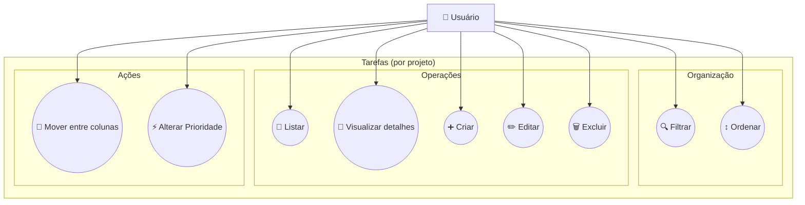
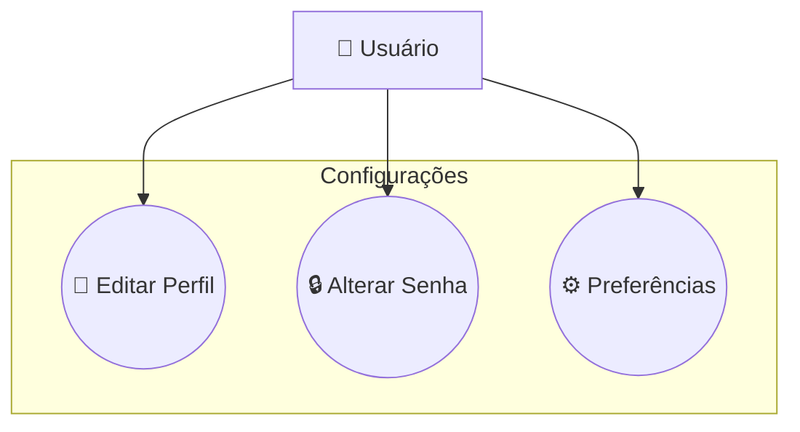

← [Voltar para Diagramas](../README.md)

---

[Início](../../../README.md) / [Diagramas](../README.md) / Casos de Uso

---

## 📌 Diagrama de Casos de Uso

> 🔐 Todas as funcionalidades exigem usuário autenticado.

### Autenticação

### Projetos

### Colunas (por projeto)

### Tarefas (por projeto)

### Configurações

