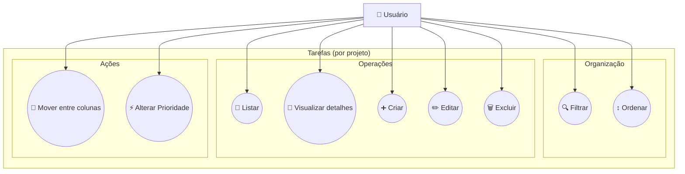

Voltar para [📌 Diagrama de Casos de Uso](../index.md)

---

[Início](../../../../README.md) | [📊 Diagramas](../../index.md) | [📌 Diagrama de Casos de Uso](../index.md) | Tarefas (por projeto)

---

## Tarefas (por projeto)

