← Voltar para [Documentação](../README.md)

## 🖼️ Wireframes

> ⚠️ Os wireframes apresentados foram gerados com auxílio de Inteligência Artificial e têm como objetivo servir como base conceitual para o design da aplicação.
> Eles representam a estrutura inicial das interfaces e fluxos do sistema, podendo sofrer alterações ao longo do desenvolvimento conforme evolução do produto.

Abaixo estão os wireframes utilizados para definir a estrutura e experiência do sistema, organizados por plataforma e fluxo de usuário.

---

## 📑 Índice

- [🌐 Versão Web](#-versão-web)
- [📱 Versão Mobile](#-versão-mobile)

---

### 🌐 Versão Web

#### 🔐 Autenticação

##### 🔑 Sign In

📌 Wireframe: `/wireframes/web/sign-in-page.png`

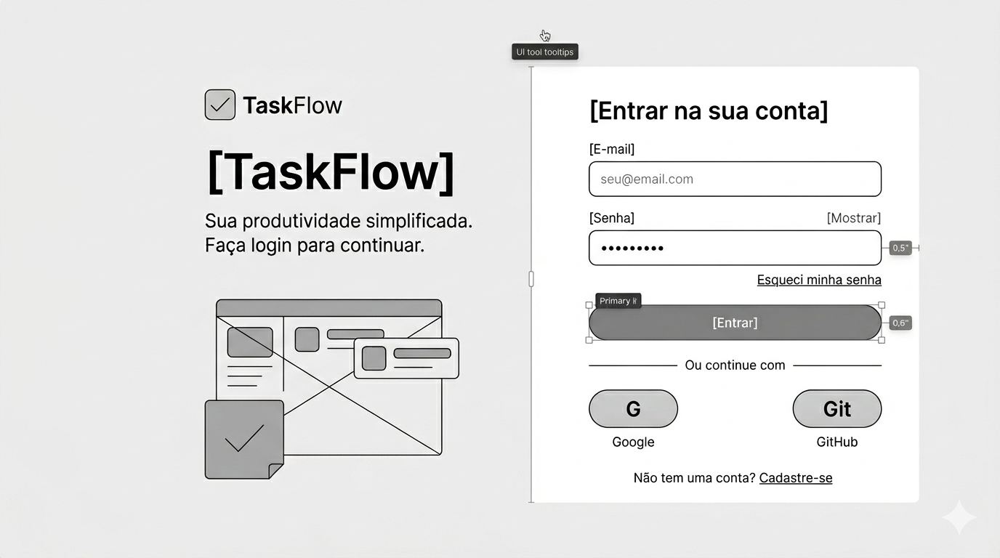

- Campo de e-mail e senha
- Botão de login
- Opção de login com Google e GitHub (futuro)
- Link para cadastro

---

##### 🆕 Sign Up

📌 Wireframe: `/wireframes/web/sign-up-page.png`

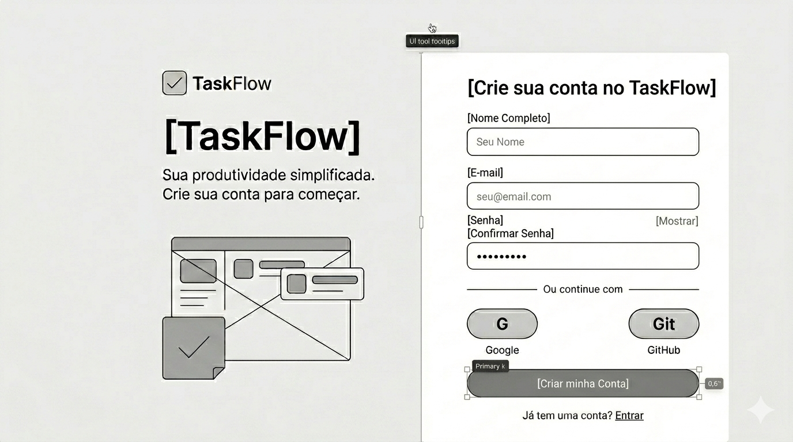

- Campos de cadastro (nome, e-mail, senha e confirmação de senha)
- Botão de criar conta
- Opção de cadastro com Google e GitHub (futuro)

---

#### 📋 Dashboard

📌 Wireframe: `/wireframes/web/dashboard-page.png`

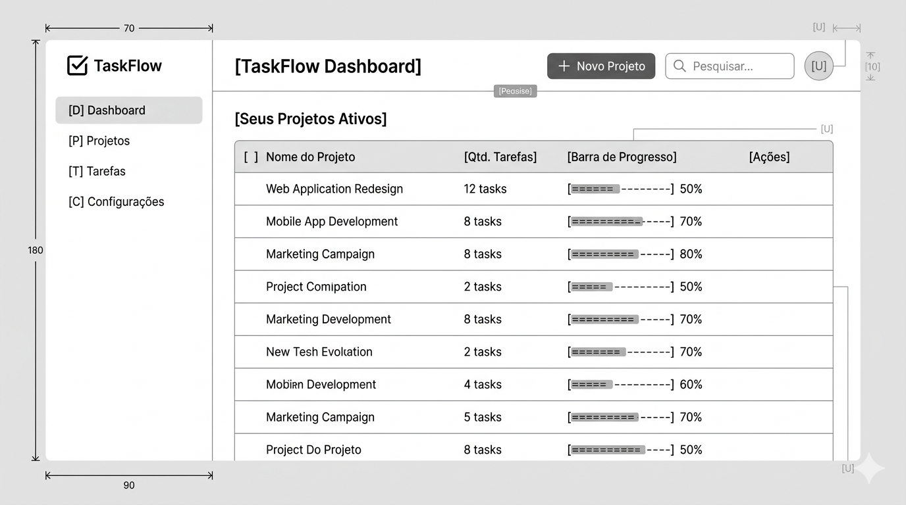

- Navegação lateral (sidebar)
- Barra superior com ações
- Lista de tarefas com ações rápidas

---

#### 📁 Projetos

##### 📂 Lista de Projetos

📌 Wireframe: `/wireframes/web/projects-page.png`

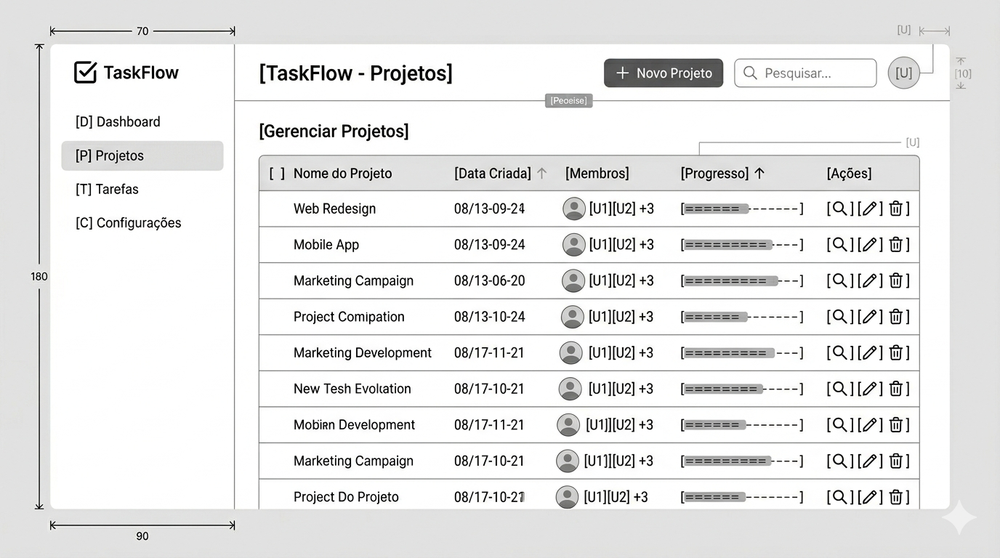

- Lista de projetos do usuário
- Botão para criar novo projeto
- Acesso rápido aos projetos

---

##### 🔍 Detalhes do Projeto

📌 Wireframe: `/wireframes/web/project-details-page.png`

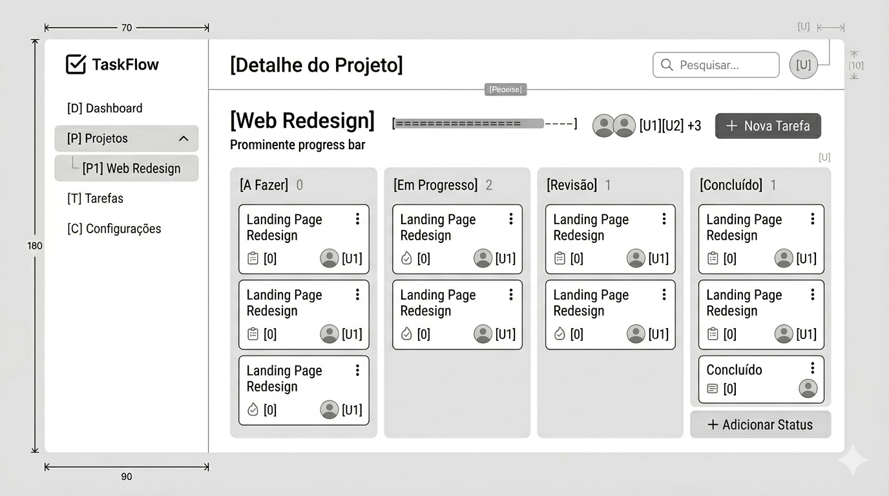

📌 Wireframe: `/wireframes/web/project-details-page-v2.png`

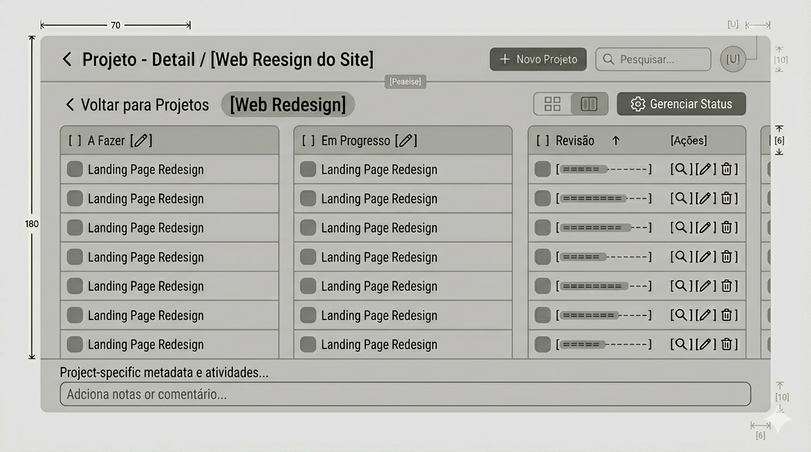

- Visualização completa do projeto
- Lista de tarefas relacionadas
- Exibição dos status do projeto
- Ações de editar e excluir projeto

---

##### ➕ Criar / Editar Projeto (Modal)

📌 Wireframe: `/wireframes/web/create-edit-project-modal.png`

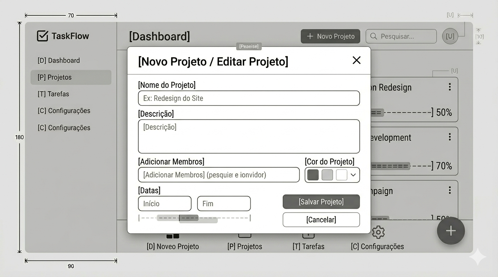

- Formulário em modal com campos para nome e descrição
- Seleção de cor ou identificação visual (opcional)
- Botões de salvar e cancelar

---

##### ❌ Excluir Projeto (Modal)

📌 Wireframe: `/wireframes/web/delete-project-modal.png`

- Formulário em modal com campos para motivo e confirmação de senha para exclusão de projeto
- Botões de excluir e cancelar

---

#### 🏷️ Status

##### 📂 Gerenciamento de Status

📌 Wireframe: `/wireframes/web/project-status-modal.png`

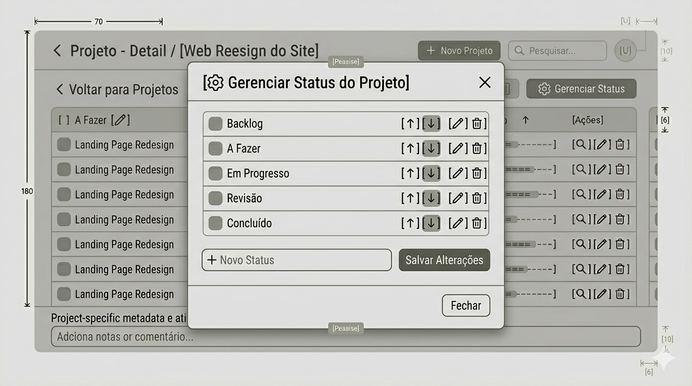

- Lista de status do projeto
- Ordenação e organização dos status
- Botão para criar novo status

---

##### ➕ Criar / Editar Status (Modal)

📌 Wireframe: `/wireframes/web/create-edit-project-status-modal.png`

- Formulário em modal
- Campo para nome do status
- Seleção de cor ou identificação visual
- Botões de salvar e cancelar

---

##### ❌ Excluir Status (Modal)

📌 Wireframe: `/wireframes/web/delete-project-status-modal.png`

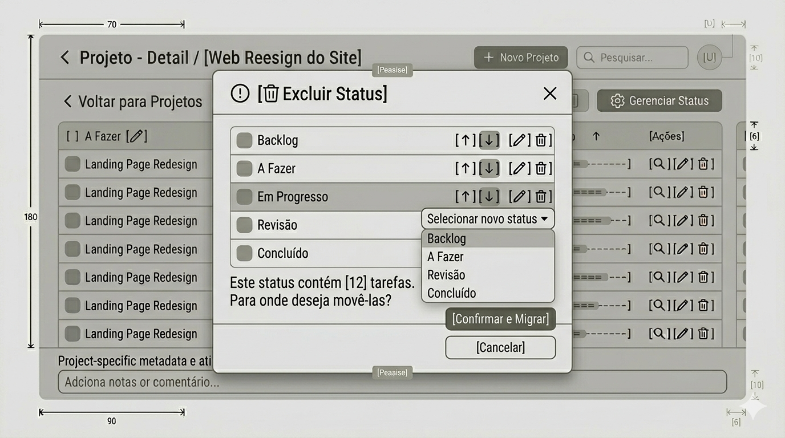

- Confirmação de exclusão
- Botões de excluir e cancelar

---

#### 📋 Tarefas

##### 📂 Lista de Tarefas

📌 Wireframe: `/wireframes/web/tasks-page.png`

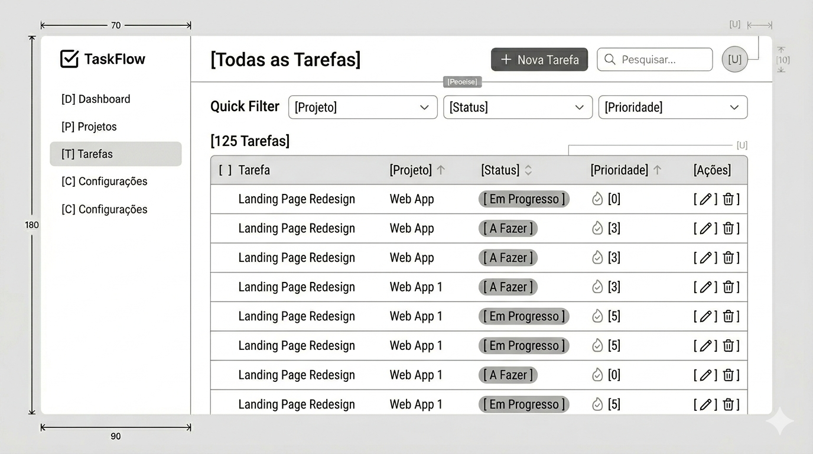

- Lista de tarefas do usuário
- Botão para criar nova tarefa
- Acesso rápido às tarefas

---

##### ➕ Criar / Editar Tarefa (Modal)

📌 Wireframe: `/wireframes/web/create-edit-task-modal.png`

- Formulário em modal
- Campos para título, descrição e prioridade

---

##### 🔍 Detalhes da Tarefa

📌 Wireframe: `/wireframes/web/task-details-modal.png`

- Visualização completa da tarefa
- Ações de editar e excluir

---

##### ❌ Excluir Tarefa (Modal)

📌 Wireframe: `/wireframes/web/delete-task-modal.png`

- Formulário em modal com campos para motivo e confirmação de senha para exclusão de tarefa
- Botões de excluir e cancelar

---

#### ⚙️ Configurações

📌 Wireframe: `/wireframes/web/settings-page.png`

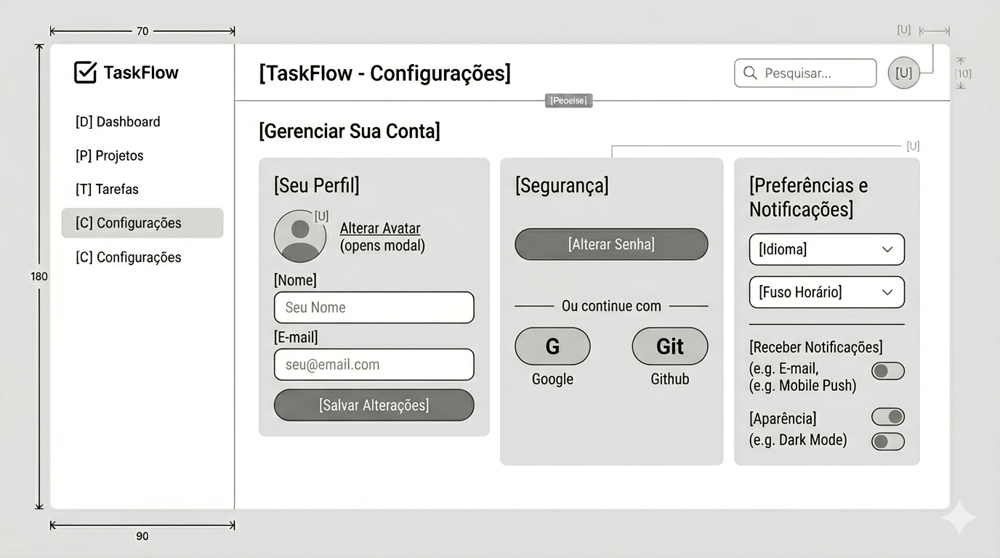

- Preferências do sistema
- Configurações de tema e comportamento

---

### 📱 Versão Mobile

#### 🔐 Autenticação

##### 🔑 Sign In

📌 Wireframe: `/wireframes/mobile/sign-in-screen.png`

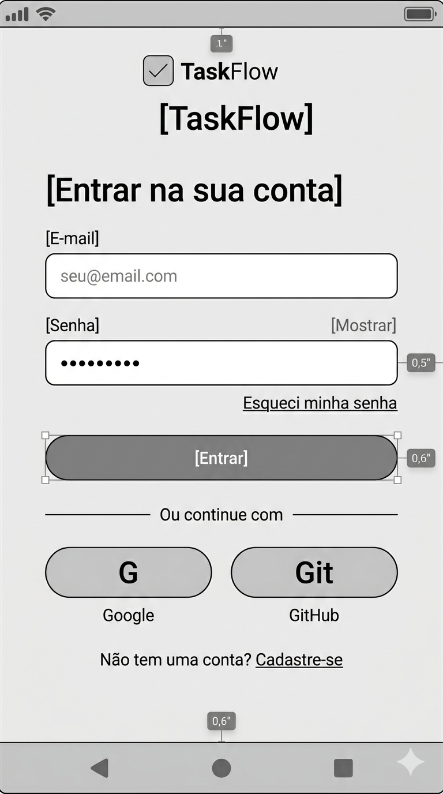

- Campo de e-mail e senha
- Botão de login
- Opção de login com Google e GitHub (futuro)
- Link para cadastro

---

##### 🆕 Sign Up

📌 Wireframe: `/wireframes/mobile/sign-up-screen.png`

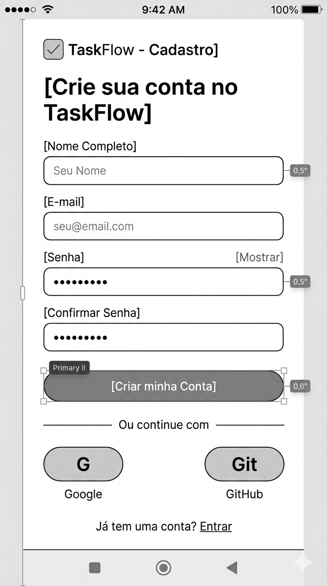

- Campos de cadastro (nome, e-mail, senha e confirmação de senha)
- Botão de criar conta
- Opção de cadastro com Google e GitHub (futuro)

---

#### 📋 Dashboard

📌 Wireframe: `/wireframes/mobile/dashboard-screen.png`

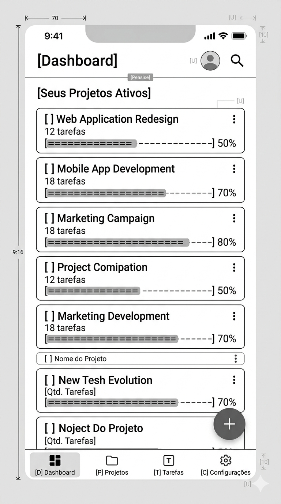

- Navegação inferior (bottom navigation) ou menu hambúrguer
- Ações rápidas no topo
- Lista de tarefas

---

#### 📁 Projetos

##### 📂 Lista de Projetos

📌 Wireframe: `/wireframes/mobile/projects-screen.png`

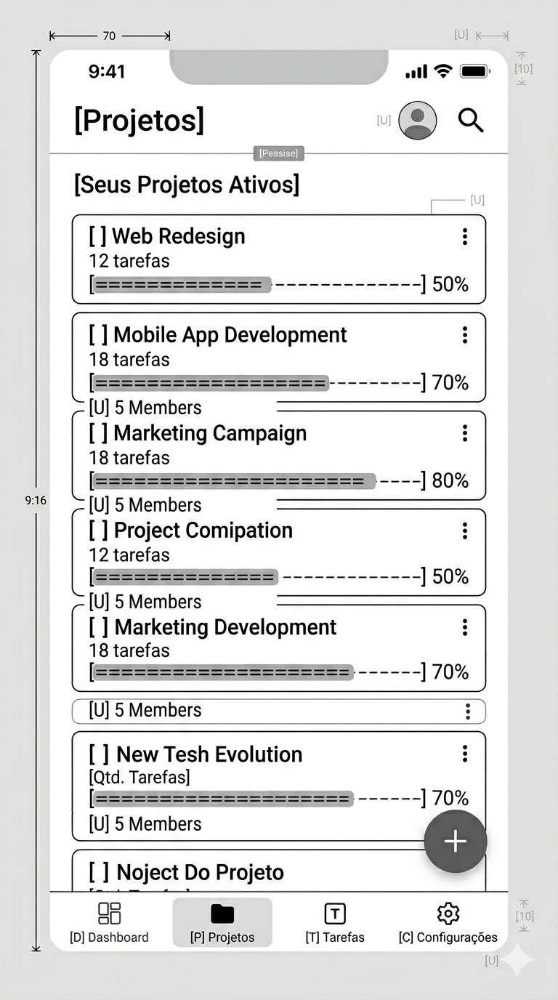

- Lista de projetos do usuário
- Botão flutuante (FAB) para criar novo projeto
- Acesso rápido aos projetos

---

##### 🔍 Detalhes do Projeto

📌 Wireframe: `/wireframes/mobile/project-details-screen.png`

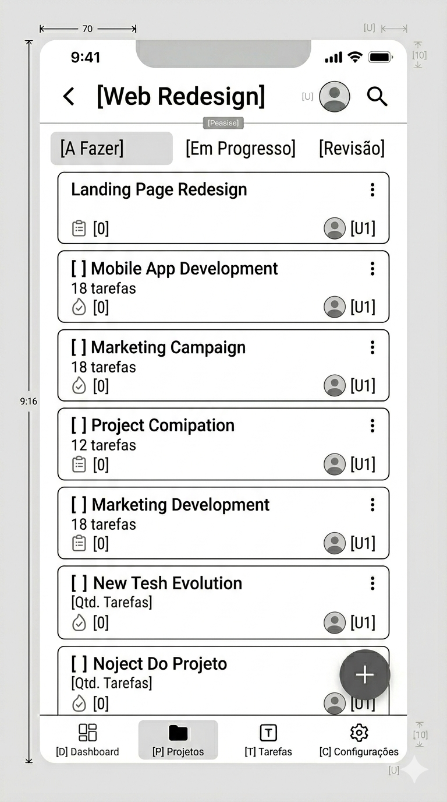

📌 Wireframe: `/wireframes/mobile/project-details-screen-v2.png`

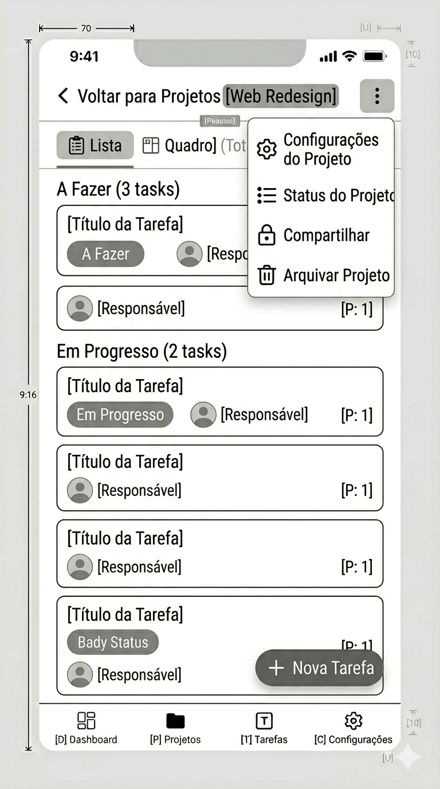

- Visualização completa do projeto
- Lista de tarefas relacionadas
- Exibição dos status do projeto
- Ações de editar e excluir projeto

---

##### ➕ Criar / Editar Projeto (Tela)

📌 Wireframe: `/wireframes/mobile/create-edit-project-screen.png`

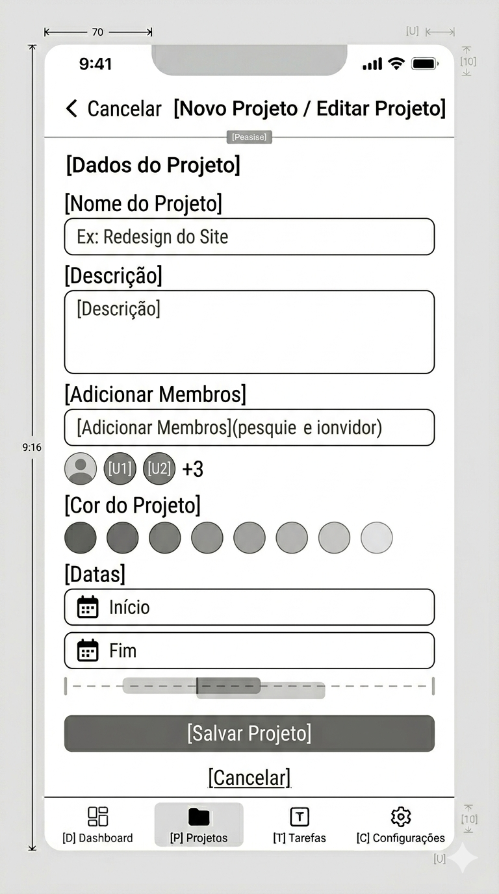

- Tela dedicada com formulário
- Campos para nome e descrição
- Seleção de cor ou identificação visual (opcional)
- Botões de salvar e voltar

---

##### ❌ Excluir Projeto (Tela)

📌 Wireframe: `/wireframes/mobile/delete-project-screen.png`

- Tela de confirmação de exclusão
- Campos para motivo e confirmação de senha
- Botões de excluir e cancelar

---

#### 🏷️ Status

##### 📂 Gerenciamento de Status

📌 Wireframe: `/wireframes/mobile/project-status-screen.png`

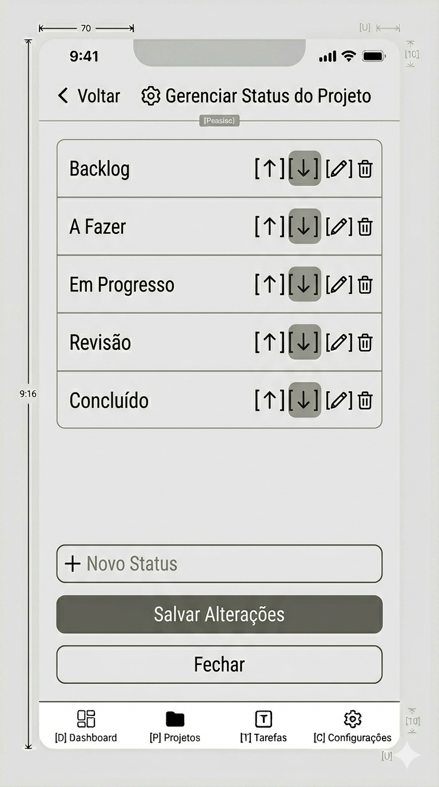

- Lista de status do projeto
- Organização dos status
- Botão flutuante (FAB) para criar novo status

---

##### ➕ Criar / Editar Status (Tela)

📌 Wireframe: `/wireframes/mobile/create-edit-project-status-screen.png`

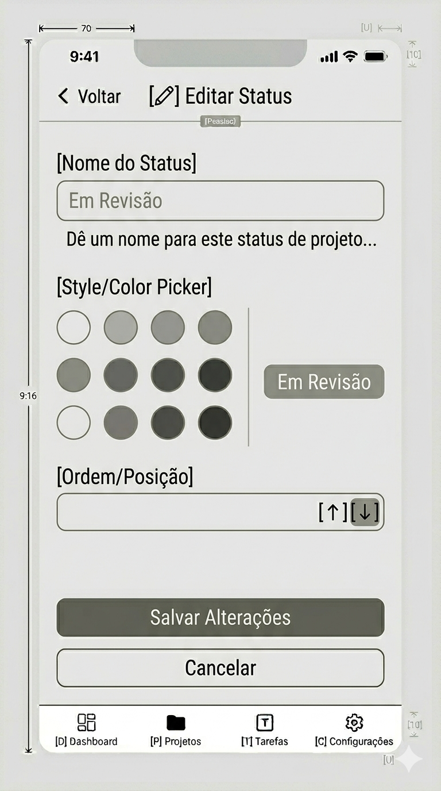

- Tela dedicada com formulário
- Campo para nome do status
- Seleção de cor ou identificação visual
- Botões de salvar e voltar

---

##### ❌ Excluir Status (Tela)

📌 Wireframe: `/wireframes/mobile/delete-project-status-screen.png`

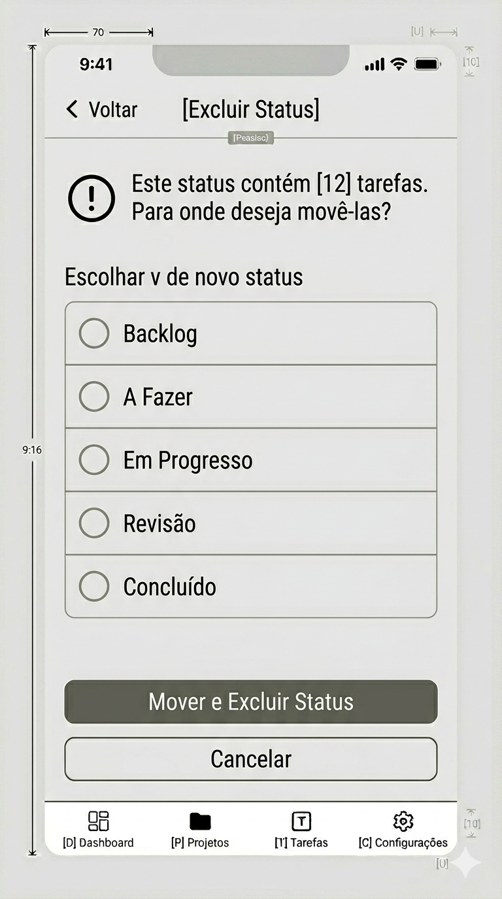

- Tela de confirmação de exclusão
- Botões de excluir e cancelar

---

#### 📋 Tarefas

##### 📂 Lista de Tarefas

📌 Wireframe: `/wireframes/mobile/tasks-screen.png`

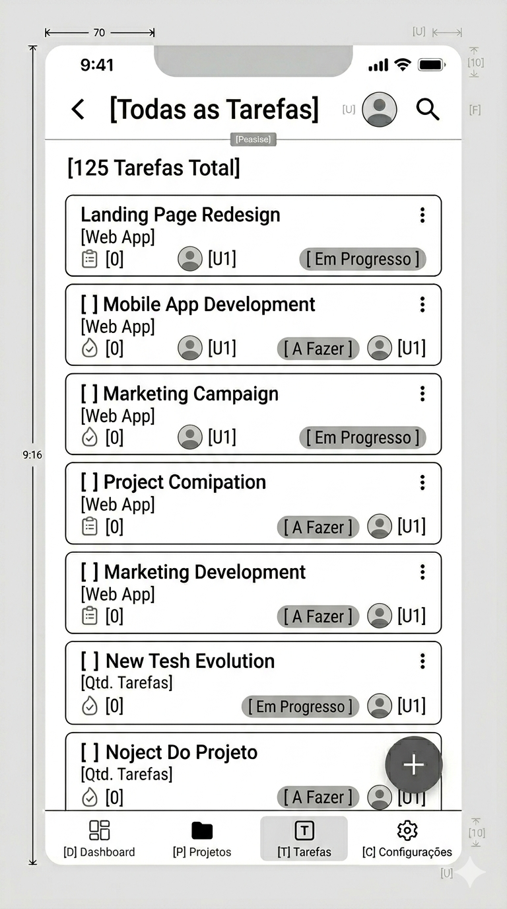

- Lista de tarefas do usuário
- Botão flutuante (FAB) para criar nova tarefa
- Acesso rápido às tarefas

---

##### ➕ Criar / Editar Tarefa (Tela)

📌 Wireframe: `/wireframes/mobile/create-edit-task-screen.png`

- Tela dedicada com formulário
- Campos para título, descrição e prioridade
- Botões de salvar e voltar

---

##### 🔍 Detalhes da Tarefa

📌 Wireframe: `/wireframes/mobile/task-details-screen.png`

- Visualização completa da tarefa
- Ações de editar e excluir

---

##### ❌ Excluir Tarefa (Tela)

📌 Wireframe: `/wireframes/mobile/delete-task-screen.png`

- Tela de confirmação de exclusão
- Campos para motivo e confirmação de senha
- Botões de excluir e cancelar

---

#### ⚙️ Configurações

📌 Wireframe: `/wireframes/mobile/settings-screen.png`

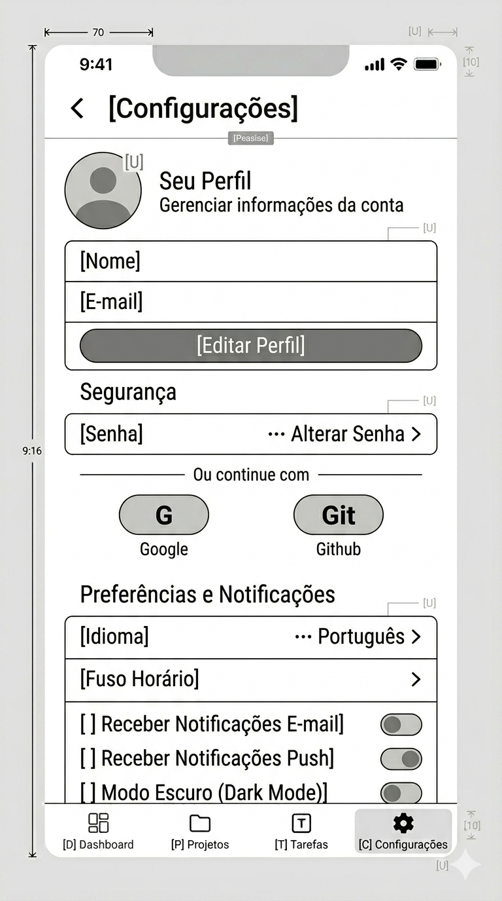

- Preferências do sistema
- Configurações de tema e comportamento

---
